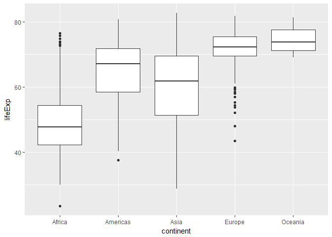

# STAT545-hw02-An-Byeongchan


```r
library(gapminder)
library(tidyverse)
```

```
## Loading tidyverse: ggplot2
## Loading tidyverse: tibble
## Loading tidyverse: tidyr
## Loading tidyverse: readr
## Loading tidyverse: purrr
## Loading tidyverse: dplyr
```

```
## Conflicts with tidy packages ----------------------------------------------
```

```
## filter(): dplyr, stats
## lag():    dplyr, stats
```

## Smell test the data
- **Is it a data.frame, a matrix, a vector, a list?**

```r
typeof(gapminder)
```

```
## [1] "list"
```

```r
str(gapminder)
```

```
## Classes 'tbl_df', 'tbl' and 'data.frame':	1704 obs. of  6 variables:
##  $ country  : Factor w/ 142 levels "Afghanistan",..: 1 1 1 1 1 1 1 1 1 1 ...
##  $ continent: Factor w/ 5 levels "Africa","Americas",..: 3 3 3 3 3 3 3 3 3 3 ...
##  $ year     : int  1952 1957 1962 1967 1972 1977 1982 1987 1992 1997 ...
##  $ lifeExp  : num  28.8 30.3 32 34 36.1 ...
##  $ pop      : int  8425333 9240934 10267083 11537966 13079460 14880372 12881816 13867957 16317921 22227415 ...
##  $ gdpPercap: num  779 821 853 836 740 ...
```

- **What’s its class?**

```r
class(gapminder)
```

```
## [1] "tbl_df"     "tbl"        "data.frame"
```


- **How many variables/columns?**

```r
ncol(gapminder)
```

```
## [1] 6
```

```r
length(gapminder)
```

```
## [1] 6
```

- **How many rows/observations?**

```r
nrow(gapminder)
```

```
## [1] 1704
```

- **Can you get these facts about “extent” or “size” in more than one way? Can you imagine different functions being useful in different contexts?**

```r
dim(gapminder)
```

```
## [1] 1704    6
```

```r
summary(gapminder)
```

```
##         country        continent        year         lifeExp     
##  Afghanistan:  12   Africa  :624   Min.   :1952   Min.   :23.60  
##  Albania    :  12   Americas:300   1st Qu.:1966   1st Qu.:48.20  
##  Algeria    :  12   Asia    :396   Median :1980   Median :60.71  
##  Angola     :  12   Europe  :360   Mean   :1980   Mean   :59.47  
##  Argentina  :  12   Oceania : 24   3rd Qu.:1993   3rd Qu.:70.85  
##  Australia  :  12                  Max.   :2007   Max.   :82.60  
##  (Other)    :1632                                                
##       pop              gdpPercap       
##  Min.   :6.001e+04   Min.   :   241.2  
##  1st Qu.:2.794e+06   1st Qu.:  1202.1  
##  Median :7.024e+06   Median :  3531.8  
##  Mean   :2.960e+07   Mean   :  7215.3  
##  3rd Qu.:1.959e+07   3rd Qu.:  9325.5  
##  Max.   :1.319e+09   Max.   :113523.1  
## 
```

```r
str(gapminder)
```

```
## Classes 'tbl_df', 'tbl' and 'data.frame':	1704 obs. of  6 variables:
##  $ country  : Factor w/ 142 levels "Afghanistan",..: 1 1 1 1 1 1 1 1 1 1 ...
##  $ continent: Factor w/ 5 levels "Africa","Americas",..: 3 3 3 3 3 3 3 3 3 3 ...
##  $ year     : int  1952 1957 1962 1967 1972 1977 1982 1987 1992 1997 ...
##  $ lifeExp  : num  28.8 30.3 32 34 36.1 ...
##  $ pop      : int  8425333 9240934 10267083 11537966 13079460 14880372 12881816 13867957 16317921 22227415 ...
##  $ gdpPercap: num  779 821 853 836 740 ...
```

- **What data type is each variable?**

```r
str(gapminder)
```

```
## Classes 'tbl_df', 'tbl' and 'data.frame':	1704 obs. of  6 variables:
##  $ country  : Factor w/ 142 levels "Afghanistan",..: 1 1 1 1 1 1 1 1 1 1 ...
##  $ continent: Factor w/ 5 levels "Africa","Americas",..: 3 3 3 3 3 3 3 3 3 3 ...
##  $ year     : int  1952 1957 1962 1967 1972 1977 1982 1987 1992 1997 ...
##  $ lifeExp  : num  28.8 30.3 32 34 36.1 ...
##  $ pop      : int  8425333 9240934 10267083 11537966 13079460 14880372 12881816 13867957 16317921 22227415 ...
##  $ gdpPercap: num  779 821 853 836 740 ...
```


- **other functions**

```r
head(gapminder)
```

```
## # A tibble: 6 x 6
##       country continent  year lifeExp      pop gdpPercap
##        <fctr>    <fctr> <int>   <dbl>    <int>     <dbl>
## 1 Afghanistan      Asia  1952  28.801  8425333  779.4453
## 2 Afghanistan      Asia  1957  30.332  9240934  820.8530
## 3 Afghanistan      Asia  1962  31.997 10267083  853.1007
## 4 Afghanistan      Asia  1967  34.020 11537966  836.1971
## 5 Afghanistan      Asia  1972  36.088 13079460  739.9811
## 6 Afghanistan      Asia  1977  38.438 14880372  786.1134
```

```r
tail(gapminder)
```

```
## # A tibble: 6 x 6
##    country continent  year lifeExp      pop gdpPercap
##     <fctr>    <fctr> <int>   <dbl>    <int>     <dbl>
## 1 Zimbabwe    Africa  1982  60.363  7636524  788.8550
## 2 Zimbabwe    Africa  1987  62.351  9216418  706.1573
## 3 Zimbabwe    Africa  1992  60.377 10704340  693.4208
## 4 Zimbabwe    Africa  1997  46.809 11404948  792.4500
## 5 Zimbabwe    Africa  2002  39.989 11926563  672.0386
## 6 Zimbabwe    Africa  2007  43.487 12311143  469.7093
```


## Explore individual variables
Pick __at least__ one categorical variable and at least one quantitative variable to explore.

- **What are possible values (or range, whichever is appropriate) of each variable?**
- **What values are typical? What's the spread? What's the distribution? Etc., tailored to the variable at hand.**
- **Feel free to use summary stats, tables, figures. We're NOT expecting high production value (yet).**  
  
lifeExp variable is chosen and explored.

```r
summary(gapminder$lifeExp)
```

```
##    Min. 1st Qu.  Median    Mean 3rd Qu.    Max. 
##   23.60   48.20   60.71   59.47   70.85   82.60
```
Then, lifeExp is analyzed in each continent. Some summary stats for lifeExp in each continent are shown. The spread and the distribution can be estimated by mean, standard deviation, minimum, median, and maximum. For better understanding, the data was visualized by plotting.

```r
g1 <- gapminder %>% 
    group_by(continent) %>% 
    summarize(mean_lifeExp = mean(lifeExp), 
              std_lifeExp = sd(lifeExp),
              min_lifeExp = min(lifeExp),
              median_lifeExp = median(lifeExp),
              max_lifeExp = max(lifeExp))
g1
```

```
## # A tibble: 5 x 6
##   continent mean_lifeExp std_lifeExp min_lifeExp median_lifeExp
##      <fctr>        <dbl>       <dbl>       <dbl>          <dbl>
## 1    Africa     48.86533    9.150210      23.599        47.7920
## 2  Americas     64.65874    9.345088      37.579        67.0480
## 3      Asia     60.06490   11.864532      28.801        61.7915
## 4    Europe     71.90369    5.433178      43.585        72.2410
## 5   Oceania     74.32621    3.795611      69.120        73.6650
## # ... with 1 more variables: max_lifeExp <dbl>
```

```r
plot(x=gapminder$continent, y=gapminder$lifeExp, gapminder)
```

<!-- -->

```r
ggplot(gapminder, aes(x=continent, y=lifeExp)) +
    geom_point(aes(alpha=0.25))
```

<!-- -->


## Explore various plot types
See the [`ggplot2` tutorial](https://github.com/jennybc/ggplot2-tutorial), which also uses the `gapminder` data, for ideas.

Make a few plots, probably of the same variable you chose to characterize numerically. Try to explore more than one plot type. **Just as an example** of what I mean:
- **A scatterplot of two quantitative variables.**  
- **A plot of one quantitative variable. Maybe a histogram or densityplot or frequency polygon.**  
- **A plot of one quantitative variable and one categorical. Maybe boxplots for several continents or countries.**  


```r
#Scatter plot of x=log10(gdpPercap), y=lifeExp in each continent
p1 <- ggplot(gapminder, aes(x=gdpPercap,
                            y=lifeExp))
p1+geom_point(aes(colour=continent, alpha=0.3))+ scale_x_log10()
```

<!-- -->

```r
# Histogram and frequency polygon for lifeExp
p2 <- ggplot(gapminder, aes(lifeExp))
p2+geom_freqpoly(colour="red", size=1.3)+geom_histogram(colour="blue", alpha=0.3)
```

```
## `stat_bin()` using `bins = 30`. Pick better value with `binwidth`.
## `stat_bin()` using `bins = 30`. Pick better value with `binwidth`.
```

<!-- -->

```r
#Densityplot for lifeExp
p2+geom_density()
```

<!-- -->

```r
#Boxplot for lifeExp in each continent 
p3 <- ggplot(gapminder, aes(x=continent,
                            y=lifeExp))
p3+geom_boxplot()
```

<!-- -->

## Use `filter()`, `select()` and `%>%`
Use `filter()` to create data subsets that you want to plot.
Practice piping together `filter()` and `select()`. Possibly even piping into `ggplot()`.


```r
#Data subset is created to compare the lifeExp since 1970 in some countries including Korea, Japan, China, and Canada.
g2 <- gapminder %>%
    filter(country %in% c("Korea, Rep.", "Japan", "China", "Canada"),
           year>1970 ) %>%
    select(country, year, lifeExp, pop) %>% 
    arrange(desc(year))

g2 %>% 
  ggplot(aes(x=country,y=lifeExp)) + geom_point()
```

<!-- -->

```r
g2 %>% 
  ggplot(aes(x=year, y=lifeExp, colour=country)) + 
  geom_point() +
  geom_line()
```

<!-- -->


#### But I want to do more!

*For people who want to take things further.*

Evaluate this code and describe the result. Presumably the analyst's intent was to get the data for Rwanda and Afghanistan. Did they succeed? Why or why not? If not, what is the correct way to do this?


```r
filter(gapminder, country == c("Rwanda", "Afghanistan"))
```

```
## # A tibble: 12 x 6
##        country continent  year lifeExp      pop gdpPercap
##         <fctr>    <fctr> <int>   <dbl>    <int>     <dbl>
##  1 Afghanistan      Asia  1957  30.332  9240934  820.8530
##  2 Afghanistan      Asia  1967  34.020 11537966  836.1971
##  3 Afghanistan      Asia  1977  38.438 14880372  786.1134
##  4 Afghanistan      Asia  1987  40.822 13867957  852.3959
##  5 Afghanistan      Asia  1997  41.763 22227415  635.3414
##  6 Afghanistan      Asia  2007  43.828 31889923  974.5803
##  7      Rwanda    Africa  1952  40.000  2534927  493.3239
##  8      Rwanda    Africa  1962  43.000  3051242  597.4731
##  9      Rwanda    Africa  1972  44.600  3992121  590.5807
## 10      Rwanda    Africa  1982  46.218  5507565  881.5706
## 11      Rwanda    Africa  1992  23.599  7290203  737.0686
## 12      Rwanda    Africa  2002  43.413  7852401  785.6538
```

First of all, this code does not extract full information for Rwanda and Afghanistan from the gapminder. The code should be like below for the full information

```r
filter(gapminder, country %in% c("Rwanda", "Afghanistan"))
```

```
## # A tibble: 24 x 6
##        country continent  year lifeExp      pop gdpPercap
##         <fctr>    <fctr> <int>   <dbl>    <int>     <dbl>
##  1 Afghanistan      Asia  1952  28.801  8425333  779.4453
##  2 Afghanistan      Asia  1957  30.332  9240934  820.8530
##  3 Afghanistan      Asia  1962  31.997 10267083  853.1007
##  4 Afghanistan      Asia  1967  34.020 11537966  836.1971
##  5 Afghanistan      Asia  1972  36.088 13079460  739.9811
##  6 Afghanistan      Asia  1977  38.438 14880372  786.1134
##  7 Afghanistan      Asia  1982  39.854 12881816  978.0114
##  8 Afghanistan      Asia  1987  40.822 13867957  852.3959
##  9 Afghanistan      Asia  1992  41.674 16317921  649.3414
## 10 Afghanistan      Asia  1997  41.763 22227415  635.3414
## # ... with 14 more rows
```
At the beginning, the analyst should explore the data by plotting or making a table. Then, the analyst could analyze the data more specifically by plots, summary stats, or time-series regressions. 
  

