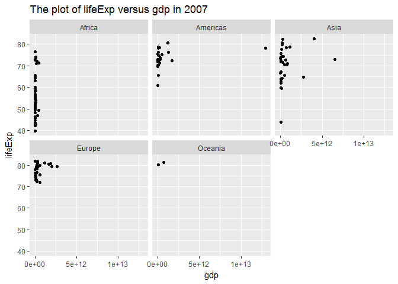
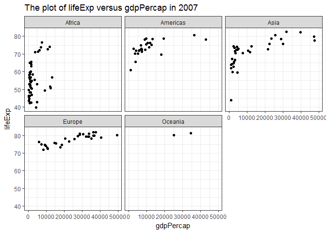
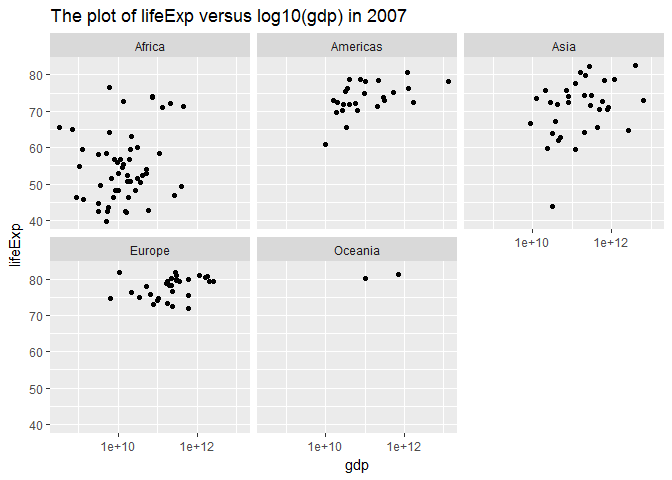

# STAT545-hw03-An-Byeongchan


```r
library(gapminder)
library(tidyverse)
```

```
## Loading tidyverse: ggplot2
## Loading tidyverse: tibble
## Loading tidyverse: tidyr
## Loading tidyverse: readr
## Loading tidyverse: purrr
## Loading tidyverse: dplyr
```

```
## Conflicts with tidy packages ----------------------------------------------
```

```
## filter(): dplyr, stats
## lag():    dplyr, stats
```

## Task menu
- Get the maximum and minimum of GDP per capita for all continents.
- Look at the spread of GDP per capita within the continents.

First of all, I got the maximum and minimum values of GDP per capita for all continents using group_by() and summarize(). Then, the table to look at the spread of GDP per capita was added.However, this table is not enough to glimpse the distribution. Therefore, boxplot is added to show the gdpPercap distribution in each continent.To see the change of the gdpPercap over time, I supplemented the plot of gdpPercap versus year using geom_point() and geom_smooth().  


```r
#The maximum and minimum values of GDP per capita for all continents
gapminder %>% 
  group_by(continent) %>% 
  summarize(max_gdpPercap = max(gdpPercap),
            min_gdpPercap = min(gdpPercap))
```

```
## # A tibble: 5 x 3
##   continent max_gdpPercap min_gdpPercap
##      <fctr>         <dbl>         <dbl>
## 1    Africa      21951.21      241.1659
## 2  Americas      42951.65     1201.6372
## 3      Asia     113523.13      331.0000
## 4    Europe      49357.19      973.5332
## 5   Oceania      34435.37    10039.5956
```

```r
#The gdpPercap distribution glimpse
gapminder %>% 
  group_by(continent) %>% 
  summarize(mean_gdpPercap = mean(gdpPercap),
            std_gdpPercap = sd(gdpPercap),
            min_gdpPercap = min(gdpPercap),
            median_gdpPercap = median(gdpPercap),
            max_gdpPercap = max(gdpPercap))  
```

```
## # A tibble: 5 x 6
##   continent mean_gdpPercap std_gdpPercap min_gdpPercap median_gdpPercap
##      <fctr>          <dbl>         <dbl>         <dbl>            <dbl>
## 1    Africa       2193.755      2827.930      241.1659         1192.138
## 2  Americas       7136.110      6396.764     1201.6372         5465.510
## 3      Asia       7902.150     14045.373      331.0000         2646.787
## 4    Europe      14469.476      9355.213      973.5332        12081.749
## 5   Oceania      18621.609      6358.983    10039.5956        17983.304
## # ... with 1 more variables: max_gdpPercap <dbl>
```

```r
#The boxplot on the gdpPercap distribution in each continent
ggplot(gapminder, aes(x=continent, y=gdpPercap)) + geom_boxplot() +
  labs(title="Boxplot")
```

<!-- -->

```r
#The change of gdpPercap over time in each continent
ggplot(gapminder, aes(x=year, y=gdpPercap, color= continent))+
  geom_point() +
  geom_smooth(se=FALSE) +
  labs(title="Regression curve")
```

```
## `geom_smooth()` using method = 'loess'
```

<!-- -->

- Compute a trimmed mean of life expectancy for different years. Or a weighted mean, weighting by population. Just try something other than the plain vanilla mean.

I computed a trimmed mean of life expectancy for different years using 'mean(lifeExp, trim=0.1)'. Trimmed means mean the fraction of observations to be trimmed from each end of values before the mean is computed. trim=0.1 means cutting off 10% of each end of values. 
In addition, the weighted mean which is weighted by population is calculated for different years. 'weighted.mean(lifeExp, pop)' is used for this.

```r
gapminder %>%
  group_by(year) %>% 
  summarize(mean_lifeExp = mean(lifeExp),
            mean_trimmed_lifeExp = mean(lifeExp, trim=0.1),
            mean_wghtd_lifeExp = weighted.mean(lifeExp, pop))
```

```
## # A tibble: 12 x 4
##     year mean_lifeExp mean_trimmed_lifeExp mean_wghtd_lifeExp
##    <int>        <dbl>                <dbl>              <dbl>
##  1  1952     49.05762             48.57668           48.94424
##  2  1957     51.50740             51.26888           52.12189
##  3  1962     53.60925             53.58075           52.32438
##  4  1967     55.67829             55.86538           56.98431
##  5  1972     57.64739             58.01444           59.51478
##  6  1977     59.57016             60.10206           61.23726
##  7  1982     61.53320             62.11694           62.88176
##  8  1987     63.21261             63.92106           64.41635
##  9  1992     64.16034             65.18519           65.64590
## 10  1997     65.01468             66.01736           66.84934
## 11  2002     65.69492             66.71641           67.83904
## 12  2007     67.00742             68.11489           68.91909
```


- How is life expectancy changing over time on different continents?

Firstly, I plotted spaghetti plot for each country's lifeExp over time distinguishing continent by color. However, this plot looks quite messy and would be better complemented by other plots.
Thus, I added a regression curve to show the lifeExp changes over time in each continent.


```r
g1 <- ggplot(gapminder, aes(x=year, y=lifeExp, 
                            color= continent))
#Spaghetti plot: It's quite hard(messy) to distinguish patterns on different continents
g1 + geom_line(aes(group= country, alpha=0.2)) +
  labs(title="Spaghetti plot")
```

<!-- -->

```r
#Regression curve: showing the change of lifeExp over time in each continent
g1 + geom_point() + 
  geom_smooth(se= TRUE) +
  labs(title="Regression curve")
```

```
## `geom_smooth()` using method = 'loess'
```

<!-- -->

- Report the absolute and/or relative abundance of countries with low life expectancy over time by continent: Compute some measure of worldwide life expectancy – you decide – a mean or median or some other quantile or perhaps your current age. Then determine how many countries on each continent have a life expectancy less than this benchmark, for each year.

I reported the absolute frequency of lower-than-median life expectancy over time by continent.
First of all, I used median across the whole data. The median was 60.71. Then I mutated one more variable which is 1 if the observation's lifeExp is smaller than the median(60.71), otherwise 0. Then, I counted the number of 1 in each year and each continent. To visualize this, I plotted the frequency of lower-than-median life expectancy over time using geom_point() and geom_line().
After this, I tried to use the median values in each year as a cutoff. I calculated the median values for each year (which is g3 in my code) and merged this to gapminder dataset. Then, I used these median values as a comparison. This plot is flatter than the former plot. This is because the median value increases as time goes by. This plot shows that the ratio of below-median lifeExp is quite constant over time in each continent.

```r
#summary stats for gapminder$lifeExp
summary(gapminder$lifeExp)
```

```
##    Min. 1st Qu.  Median    Mean 3rd Qu.    Max. 
##   23.60   48.20   60.71   59.47   70.85   82.60
```

```r
#Take median as m1 (It is easy to change to another summary stat or a constant)
m1 <- median(gapminder$lifeExp)

g2 <- gapminder %>% 
  select(country, continent, year, lifeExp) %>% 
  mutate(below_mean= ifelse(lifeExp < m1, 1, 0)) %>% #filter(lifeExp<40) does not include the frequency of 0
  group_by(year, continent) %>% 
  summarize(freq_lifeExp= sum(below_mean)) 

#Plot: The frequency of lower-than-median lifeExp over time
#Median(60.71) is extracted from the whole data 
g2 %>% 
  ggplot(aes(x=year, y=freq_lifeExp, color=continent)) + 
  geom_point() + 
  geom_line()
```

<!-- -->

```r
#Table: The frequency of lower-than-median lifeExp over time
#Median(60.71) is extracted from the whole data
g2 %>%   
  spread(key="continent", value="freq_lifeExp")
```

```
## # A tibble: 12 x 6
## # Groups:   year [12]
##     year Africa Americas  Asia Europe Oceania
##  * <int>  <dbl>    <dbl> <dbl>  <dbl>   <dbl>
##  1  1952     52       19    30      7       0
##  2  1957     52       16    27      3       0
##  3  1962     52       13    26      1       0
##  4  1967     51       13    25      1       0
##  5  1972     50       10    20      1       0
##  6  1977     50        7    16      1       0
##  7  1982     46        5    12      0       0
##  8  1987     41        2    10      0       0
##  9  1992     40        2     8      0       0
## 10  1997     44        1     7      0       0
## 11  2002     41        1     5      0       0
## 12  2007     41        0     3      0       0
```

```r
  #Why this is not working?   
  #reshape(idvar= "year", timevar= "continent", direction= "wide")

#Calculating median for each time period (year)
g3 <- gapminder %>%
  select(country, continent, year, lifeExp) %>% 
  group_by(year) %>% 
  summarize(median_lifeExp= median(lifeExp))  
g3
```

```
## # A tibble: 12 x 2
##     year median_lifeExp
##    <int>          <dbl>
##  1  1952        45.1355
##  2  1957        48.3605
##  3  1962        50.8810
##  4  1967        53.8250
##  5  1972        56.5300
##  6  1977        59.6720
##  7  1982        62.4415
##  8  1987        65.8340
##  9  1992        67.7030
## 10  1997        69.3940
## 11  2002        70.8255
## 12  2007        71.9355
```

```r
g4 <- left_join(gapminder, g3) %>% 
  select(country, continent, year, lifeExp, median_lifeExp) %>% 
  mutate(below_mean= ifelse(lifeExp < median_lifeExp, 1, 0)) %>% 
  group_by(year, continent) %>% 
  summarize(freq_lifeExp= sum(below_mean)) 
```

```
## Joining, by = "year"
```

```r
#Plot: The frequency of lower-than-median lifeExp over time
#Medians are calculated for each year
g4 %>% ggplot(aes(x=year, y=freq_lifeExp, color=continent)) + 
  geom_point() +
  geom_line()
```

<!-- -->

```r
#Table: The frequency of lower-than-median lifeExp over time
#Medians are calculated for each year
g4 %>% spread(key="continent", value="freq_lifeExp")
```

```
## # A tibble: 12 x 6
## # Groups:   year [12]
##     year Africa Americas  Asia Europe Oceania
##  * <int>  <dbl>    <dbl> <dbl>  <dbl>   <dbl>
##  1  1952     47        6    17      1       0
##  2  1957     47        6    17      1       0
##  3  1962     47        6    18      0       0
##  4  1967     48        6    17      0       0
##  5  1972     50        6    15      0       0
##  6  1977     49        7    14      1       0
##  7  1982     49        7    14      1       0
##  8  1987     48        8    14      1       0
##  9  1992     47        8    15      1       0
## 10  1997     48        7    15      1       0
## 11  2002     47        8    16      0       0
## 12  2007     47        8    15      1       0
```

Decent-looking table trial

```r
knitr::kable(g4 %>% spread(key="continent", value="freq_lifeExp"))
```


 year   Africa   Americas   Asia   Europe   Oceania
-----  -------  ---------  -----  -------  --------
 1952       47          6     17        1         0
 1957       47          6     17        1         0
 1962       47          6     18        0         0
 1967       48          6     17        0         0
 1972       50          6     15        0         0
 1977       49          7     14        1         0
 1982       49          7     14        1         0
 1987       48          8     14        1         0
 1992       47          8     15        1         0
 1997       48          7     15        1         0
 2002       47          8     16        0         0
 2007       47          8     15        1         0

- Find countries with interesting stories. Open-ended and, therefore, hard. Promising but unsuccessful attempts are encouraged. This will generate interesting questions to follow up on in class.
  
I tried to see if there was any linear relationship between gdp(or gdpPercap) and lifeExp. Thus, I fixed the time period (year) to 2007. (gdp was calculated as gdpPercap*pop)
First of all, I tried to make a plot of lifeExp versus gdp (and then gdpPercap) in each continent. However, the plots showed that there was no linear relationship between them.
Then, I tried to scale gdp(and gdpPercap) in log10. 

```r
g5 <- gapminder %>% 
  filter(year==2007) %>% 
  mutate(gdp = gdpPercap*pop)

g5 %>% 
  ggplot(aes(x=gdp, y=lifeExp)) + 
  facet_wrap(~ continent) +
  geom_point() +
  labs(title="The plot of lifeExp versus gdp in 2007")
```

<!-- -->

```r
g5 %>% 
  ggplot(aes(x=gdpPercap, y=lifeExp)) + 
  facet_wrap(~ continent) +
  geom_point() +
  theme_bw() +
  labs(title="The plot of lifeExp versus gdpPercap in 2007")
```

<!-- -->

```r
g5 %>% 
  ggplot(aes(x=gdp, y=lifeExp)) + 
  facet_wrap(~ continent) +
  geom_point() +
  scale_x_log10() +
  labs(title="The plot of lifeExp versus log10(gdp) in 2007")
```

<!-- -->

```r
g5 %>% 
  ggplot(aes(x=gdpPercap, y=lifeExp)) + 
  facet_wrap(~ continent) +
  geom_point() +
  theme_bw() +
  scale_x_log10() +
  labs(title="The plot of lifeExp versus log10(gdpPercap) in 2007")
```

<!-- -->

```r
#g6 <- g5 %>%
#  filter(country %in% c("Canada", "Australia", "Korea, Rep.", "Japan", "China"))
#g6 %>% 
#  ggplot(aes(x=year, y=gdp, color=country)) + geom_point()
```

There might be linear relationship between lifeExp and log10(gdpPercap). Thus, I tried to compare each coefficients from linear regression.
Even though there were quite big differences among intercepts, slope coefficients were quite similar. (I couldn't run linear regression for America.)
Further analysis such as R squared is needed for better interpretation.

```r
fit_Africa <- lm(lifeExp ~ log(gdpPercap), 
                 data = filter(g5,continent=="Africa"))
#fit_America <- lm(lifeExp ~ log(gdpPercap), 
#                  data =filter(g5,continent=="America")) 
fit_Asia <- lm(lifeExp ~ log(gdpPercap), 
                  data =filter(g5,continent=="Asia"))
fit_Europe <- lm(lifeExp ~ log(gdpPercap), 
                  data =filter(g5,continent=="Europe")) 
fit_Oceania <- lm(lifeExp ~ log(gdpPercap), 
                  data =filter(g5,continent=="Oceania"))
fit_Africa$coefficients
```

```
##    (Intercept) log(gdpPercap) 
##      22.906824       4.260876
```

```r
fit_Asia$coefficients
```

```
##    (Intercept) log(gdpPercap) 
##      25.650115       5.157259
```

```r
fit_Europe$coefficients
```

```
##    (Intercept) log(gdpPercap) 
##      35.438954       4.226892
```

```r
fit_Oceania$coefficients
```

```
##    (Intercept) log(gdpPercap) 
##      46.805720       3.295665
```


  
  
  
  
  
  
