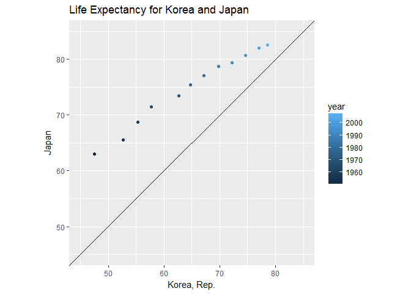
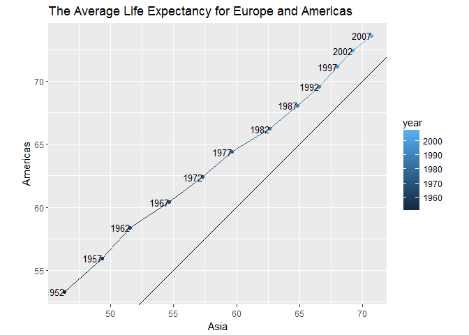

# STAT545-hw04-An-Byeongchan


```r
suppressPackageStartupMessages(library(tidyverse))
```

```
## Warning: package 'tidyverse' was built under R version 3.4.2
```

```r
suppressPackageStartupMessages(library(gapminder))
```


### Choose your own adventure

- Pick a join prompt and do it.  
  
I used the dataset `areas` which was dealt with in class. I tried to combine gapminder data in 2007 with `areas`. As I used right_join(), `g1` preserves all the rows of `areas`. Here, I did not specify a character vector of variables to join by using `by = "country"`. This was because there was only one variable in common.  
In addition, I compared `full_join()` with `left_join()`. Because `gapminder` does not have `"Vatican City"` which is included in `areas`, `full_join()` creates one more observation (which is for `Vatican City`), compared to `left_join()`  

```r
areas <- data.frame(country=c("Canada", "United States", "India", "Vatican City"),
                     area=c(998.5*10^6, 983.4*10^6, 328.7*10^6, 44))

g1 <- gapminder %>% 
  filter(year == 2007) %>% 
  right_join(areas)
```

```
## Joining, by = "country"
```

```
## Warning: Column `country` joining factors with different levels, coercing
## to character vector
```

```r
g1
```

```
## # A tibble: 4 x 7
##         country continent  year lifeExp        pop gdpPercap      area
##           <chr>    <fctr> <int>   <dbl>      <int>     <dbl>     <dbl>
## 1        Canada  Americas  2007  80.653   33390141  36319.24 998500000
## 2 United States  Americas  2007  78.242  301139947  42951.65 983400000
## 3         India      Asia  2007  64.698 1110396331   2452.21 328700000
## 4  Vatican City      <NA>    NA      NA         NA        NA        44
```

```r
# The number of observations using full_join()
nrow(full_join(gapminder, areas, by = "country"))
```

```
## Warning: Column `country` joining factors with different levels, coercing
## to character vector
```

```
## [1] 1705
```

```r
# The number of observations using left_join()
nrow(left_join(gapminder, areas, by = "country"))
```

```
## Warning: Column `country` joining factors with different levels, coercing
## to character vector
```

```
## [1] 1704
```

- Pick one of the data reshaping prompts and do it.  
I trid to use `gather()` for long format and `spread()` for wide format.

```r
g2 <- g1 %>% 
  select(country, continent, pop, gdpPercap, area) %>% 
  gather(key = "Measures", value = "My_value", pop, gdpPercap, area)
g2
```

```
## # A tibble: 12 x 4
##          country continent  Measures     My_value
##            <chr>    <fctr>     <chr>        <dbl>
##  1        Canada  Americas       pop 3.339014e+07
##  2 United States  Americas       pop 3.011399e+08
##  3         India      Asia       pop 1.110396e+09
##  4  Vatican City      <NA>       pop           NA
##  5        Canada  Americas gdpPercap 3.631924e+04
##  6 United States  Americas gdpPercap 4.295165e+04
##  7         India      Asia gdpPercap 2.452210e+03
##  8  Vatican City      <NA> gdpPercap           NA
##  9        Canada  Americas      area 9.985000e+08
## 10 United States  Americas      area 9.834000e+08
## 11         India      Asia      area 3.287000e+08
## 12  Vatican City      <NA>      area 4.400000e+01
```

```r
g2 %>% 
  spread(key = "Measures", value = "My_value")
```

```
## # A tibble: 4 x 5
##         country continent      area gdpPercap        pop
## *         <chr>    <fctr>     <dbl>     <dbl>      <dbl>
## 1        Canada  Americas 998500000  36319.24   33390141
## 2         India      Asia 328700000   2452.21 1110396331
## 3 United States  Americas 983400000  42951.65  301139947
## 4  Vatican City      <NA>        44        NA         NA
```


### General data reshaping and relationship to aggregation

__Problem__: You have data in one "shape" but you wish it were in another. Usually this is because the alternative shape is superior for presenting a table, making a figure, or doing aggregation and statistical analysis.

__Solution__: Reshape your data. For simple reshaping, `gather()` and `spread()` from `tidyr` will suffice. Do the thing that it possible / easier now that your data has a new shape.

__Prompts__:

Activity #1
- two `tidyr` functions
1. `gather(key = "key", value = "value", ...)`  
  
2. `spread(key = "key", value = "value", ...)`  
Make sure that there is no duplicate to use `spread()`. When there are more-than-one observations (which have same values except for "key" values) for the same "key" value, the function does not work. This can be fixed by distinguishing each observation using other variables or using `dcast()` putting the mean, variance, or sum to the value (`dcast()` is the function in `reshape2`)

Tyler Rinker's [minimal guide to `tidyr`](https://github.com/trinker/tidyr_in_a_nutshell).  

Activity #2
  * Make a tibble with one row per year and columns for life expectancy for two or more countries.
    - Use `knitr::kable()` to make this table look pretty in your rendered homework.
    - Take advantage of this new data shape to scatterplot life expectancy for one country against that of another.
    
This tibble makes it easier to compare the life expectancy for the selected countries. `spread()` is useful for this situation. Also, is easier plotting a scatterplot values for one country against those of another. This is because all the countries' name becomes the header of each column.  
I compared the life expectancy for Japan with that for Republic of Korea. I added reference line which is `y=x`. It helps to analyze and interpret the plot. The life expectancy for Japan is always higher than that for Republic of Korea. 


```r
g3 <- gapminder %>% 
  select(country, year, lifeExp) %>% 
  filter(country %in% c("Korea, Rep.", "Japan", "Canada", "Australia")) %>% 
  spread(key = "country", value = "lifeExp")
knitr::kable(g3, format = "markdown")
```


| year| Australia| Canada|  Japan| Korea, Rep.|
|----:|---------:|------:|------:|-----------:|
| 1952|    69.120| 68.750| 63.030|      47.453|
| 1957|    70.330| 69.960| 65.500|      52.681|
| 1962|    70.930| 71.300| 68.730|      55.292|
| 1967|    71.100| 72.130| 71.430|      57.716|
| 1972|    71.930| 72.880| 73.420|      62.612|
| 1977|    73.490| 74.210| 75.380|      64.766|
| 1982|    74.740| 75.760| 77.110|      67.123|
| 1987|    76.320| 76.860| 78.670|      69.810|
| 1992|    77.560| 77.950| 79.360|      72.244|
| 1997|    78.830| 78.610| 80.690|      74.647|
| 2002|    80.370| 79.770| 82.000|      77.045|
| 2007|    81.235| 80.653| 82.603|      78.623|

```r
g3 %>% 
  ggplot(aes(x = `Korea, Rep.`, y = Japan, color = year)) +
  geom_point() +
  labs(title = "Life Expectancy for Korea and Japan") +
  coord_fixed(xlim = c(45, 85), ylim = c(45, 85)) +
  geom_abline()
```

<!-- -->


Activity #3

  * Compute some measure of life expectancy (mean? median? min? max?) for all possible combinations of continent and year. Reshape that to have one row per year and one variable for each continent. Or the other way around: one row per continent and one variable per year.
    - Use `knitr::kable()` to make these tables look pretty in your rendered homework.
    - Is there a plot that is easier to make with the data in this shape versis the usual form? If so (or you think so), try it! Reflect.
    

I computed the `mean` of life expectancy for all possible combinations of continent and year by using `group_by()` and `summarize()`. Then, I reshaped it using `spread()`.  
As explained in the previous Activity, this reshaped form would be useful to compare one continent's life expectancy with another's. This is because all the continents' name becomes the header of each column.  

```r
g4 <- gapminder %>%
  select(country, continent, year, lifeExp) %>% 
  group_by(year, continent) %>% 
  summarize(lifeExp_mean = mean(lifeExp)) %>% 
  spread(key = "continent", value = "lifeExp_mean")
knitr::kable(g4, format = "markdown", digits = 2)
```


| year| Africa| Americas|  Asia| Europe| Oceania|
|----:|------:|--------:|-----:|------:|-------:|
| 1952|  39.14|    53.28| 46.31|  64.41|   69.25|
| 1957|  41.27|    55.96| 49.32|  66.70|   70.30|
| 1962|  43.32|    58.40| 51.56|  68.54|   71.09|
| 1967|  45.33|    60.41| 54.66|  69.74|   71.31|
| 1972|  47.45|    62.39| 57.32|  70.78|   71.91|
| 1977|  49.58|    64.39| 59.61|  71.94|   72.85|
| 1982|  51.59|    66.23| 62.62|  72.81|   74.29|
| 1987|  53.34|    68.09| 64.85|  73.64|   75.32|
| 1992|  53.63|    69.57| 66.54|  74.44|   76.94|
| 1997|  53.60|    71.15| 68.02|  75.51|   78.19|
| 2002|  53.33|    72.42| 69.23|  76.70|   79.74|
| 2007|  54.81|    73.61| 70.73|  77.65|   80.72|

```r
g4 %>% 
  ggplot(aes(x = Asia, y = Americas, color = year)) +
  geom_point() +
  geom_path() +
  geom_text(aes(label = year), color = "black",size = 3.5, hjust = 1) +
  labs(title = "The Average Life Expectancy for Europe and Americas") +
  coord_fixed() +
  geom_abline()
```

<!-- -->


Activity #4

  * In [Window functions](http://stat545.com/block010_dplyr-end-single-table.html#window-functions), we formed a tibble with 24 rows: 2 per year, giving the country with both the lowest and highest life expectancy (in Asia). Take that table (or a similar one for all continents) and reshape it so you have one row per year or per year * continent combination.
  
I used the gapminder dataset and formed a dataset which shows the Asian countries with the highest life expectancy and the lowest in each year. I could keep the highest and lowest life expectancy observations in each year using `filter(min_rank(desc(lifeExp)) < 2 | min_rank(lifeExp) < 2)`. 

```r
my_gap <- gapminder%>%
  filter(continent == "Asia") %>%
  select(year, country, lifeExp) %>%
  group_by(year) %>%
  filter(min_rank(desc(lifeExp)) < 2 | min_rank(lifeExp) < 2) %>% 
  mutate(min_rank(desc(lifeExp))) %>% 
  arrange(year) %>% 
  select(-lifeExp) %>% 
  spread(key = "min_rank(desc(lifeExp))", value = "country") %>% 
  rename(Highest =  `1`, Lowest  =  `2`)
#  print(n = Inf)

knitr::kable(my_gap, format = "markdown")
```


| year|Highest |Lowest      |
|----:|:-------|:-----------|
| 1952|Israel  |Afghanistan |
| 1957|Israel  |Afghanistan |
| 1962|Israel  |Afghanistan |
| 1967|Japan   |Afghanistan |
| 1972|Japan   |Afghanistan |
| 1977|Japan   |Cambodia    |
| 1982|Japan   |Afghanistan |
| 1987|Japan   |Afghanistan |
| 1992|Japan   |Afghanistan |
| 1997|Japan   |Afghanistan |
| 2002|Japan   |Afghanistan |
| 2007|Japan   |Afghanistan |


### Join, merge, look up

__Problem__: You have two data sources and you need info from both in one new data object.

__Solution__: Perform a __join__, which borrows terminology from the database world, specifically SQL.

__Prompts__:

Activity #1

  * Create a second data frame, complementary to Gapminder. Join this with (part of) Gapminder using a `dplyr` join function and make some observations about the process and result. Explore the different types of joins. Examples of a second data frame you could build:
    - One row per country, a country variable and one or more variables with extra info, such as language spoken, NATO membership, national animal, or capitol city. If you really want to be helpful, you could attempt to make a pull request to resolve [this issue](https://github.com/jennybc/gapminder/issues/13), where I would like to bring ISO country codes into the gapminder package.
    - One row per continent, a continent variable and one or more variables with extra info, such as northern versus southern hemisphere.
    

I created a second data frame complementary to Gapminder, which contained country, capital_city, and Language. For simplicity, I used gapminder data after 2000.

```r
extra_info <- data.frame(country=c("Korea, Rep.", "Japan", "China", "Canada","Australia", "United States", "Vatican City"),
                     capital_city=c("Seoul", "Tokyo", "Beijing", "Ottawa","Canberra", "Washington, D.C.", "Vatican City"),
                     Language = c("Korean", "Japanese", "Standard Mandarin", "English/French","English", "English", "Italian"))
extra_info
```

```
##         country     capital_city          Language
## 1   Korea, Rep.            Seoul            Korean
## 2         Japan            Tokyo          Japanese
## 3         China          Beijing Standard Mandarin
## 4        Canada           Ottawa    English/French
## 5     Australia         Canberra           English
## 6 United States Washington, D.C.           English
## 7  Vatican City     Vatican City           Italian
```

```r
gapminder_2000s <- gapminder %>% 
  filter(year >= 2000)
gapminder_2000s
```

```
## # A tibble: 284 x 6
##        country continent  year lifeExp      pop  gdpPercap
##         <fctr>    <fctr> <int>   <dbl>    <int>      <dbl>
##  1 Afghanistan      Asia  2002  42.129 25268405   726.7341
##  2 Afghanistan      Asia  2007  43.828 31889923   974.5803
##  3     Albania    Europe  2002  75.651  3508512  4604.2117
##  4     Albania    Europe  2007  76.423  3600523  5937.0295
##  5     Algeria    Africa  2002  70.994 31287142  5288.0404
##  6     Algeria    Africa  2007  72.301 33333216  6223.3675
##  7      Angola    Africa  2002  41.003 10866106  2773.2873
##  8      Angola    Africa  2007  42.731 12420476  4797.2313
##  9   Argentina  Americas  2002  74.340 38331121  8797.6407
## 10   Argentina  Americas  2007  75.320 40301927 12779.3796
## # ... with 274 more rows
```

As mentioned above, I did not specify a character vector of variables to join by using `by = "country"`. This was because there was only one variable in common. 

1. `semi_join()` creates a subset of the `gapminder_2000s`(which is on the left), which have the countries that are only found in the `extra_info`(which is on the right).

2. `inner_join()` creates the dataset which has all the variables in `gapminder_2000s` and `extra_info`. The dataset only keeps observations available in both datasets. 

3. `right_join()` creates the dataset which has all the variables in `gapminder_2000s` and `extra_info`. The dataset only keeps observations available in `extra_info`(which is on the right).

4. `left_join()` is same as `right_join()` but the dataset keeps observations available in `gapminder_2000s`(which is on the left)

5. `full_join()` creates the dataset which has all the variables in `gapminder_2000s` and `extra_info`. The dataset keeps all the observations available in both datasets.

- The difference between `semi_join` and `inner_join` is that `semi_join()` takes only the variables on the left. This can be verified by seeing the dimension of each dataset. Inner-joined dataset's dimension is (12x6)(6 is same as the number of variables in `gapminder_2000s` ). On the contrary, the other one's dimension is (12x8).

- Right_joined dataset has one more observation than inner-joined dataset. This is because `Vatican City` is not included in the `gapminder_2000s`. This also can be observed by comparing `left_join()` and `full_join()`


```r
#semi_join()
semi_join(gapminder_2000s, extra_info)
```

```
## Joining, by = "country"
```

```
## Warning: Column `country` joining factors with different levels, coercing
## to character vector
```

```
## # A tibble: 12 x 6
##          country continent  year lifeExp        pop gdpPercap
##           <fctr>    <fctr> <int>   <dbl>      <int>     <dbl>
##  1     Australia   Oceania  2002  80.370   19546792 30687.755
##  2     Australia   Oceania  2007  81.235   20434176 34435.367
##  3        Canada  Americas  2002  79.770   31902268 33328.965
##  4        Canada  Americas  2007  80.653   33390141 36319.235
##  5         China      Asia  2002  72.028 1280400000  3119.281
##  6         China      Asia  2007  72.961 1318683096  4959.115
##  7         Japan      Asia  2002  82.000  127065841 28604.592
##  8         Japan      Asia  2007  82.603  127467972 31656.068
##  9   Korea, Rep.      Asia  2002  77.045   47969150 19233.988
## 10   Korea, Rep.      Asia  2007  78.623   49044790 23348.140
## 11 United States  Americas  2002  77.310  287675526 39097.100
## 12 United States  Americas  2007  78.242  301139947 42951.653
```

```r
#inner_join()
inner_join(gapminder_2000s, extra_info)
```

```
## Joining, by = "country"
```

```
## Warning: Column `country` joining factors with different levels, coercing
## to character vector
```

```
## # A tibble: 12 x 8
##          country continent  year lifeExp        pop gdpPercap
##            <chr>    <fctr> <int>   <dbl>      <int>     <dbl>
##  1     Australia   Oceania  2002  80.370   19546792 30687.755
##  2     Australia   Oceania  2007  81.235   20434176 34435.367
##  3        Canada  Americas  2002  79.770   31902268 33328.965
##  4        Canada  Americas  2007  80.653   33390141 36319.235
##  5         China      Asia  2002  72.028 1280400000  3119.281
##  6         China      Asia  2007  72.961 1318683096  4959.115
##  7         Japan      Asia  2002  82.000  127065841 28604.592
##  8         Japan      Asia  2007  82.603  127467972 31656.068
##  9   Korea, Rep.      Asia  2002  77.045   47969150 19233.988
## 10   Korea, Rep.      Asia  2007  78.623   49044790 23348.140
## 11 United States  Americas  2002  77.310  287675526 39097.100
## 12 United States  Americas  2007  78.242  301139947 42951.653
## # ... with 2 more variables: capital_city <fctr>, Language <fctr>
```

```r
#right_join()
right_join(gapminder_2000s, extra_info)
```

```
## Joining, by = "country"
```

```
## Warning: Column `country` joining factors with different levels, coercing
## to character vector
```

```
## # A tibble: 13 x 8
##          country continent  year lifeExp        pop gdpPercap
##            <chr>    <fctr> <int>   <dbl>      <int>     <dbl>
##  1   Korea, Rep.      Asia  2002  77.045   47969150 19233.988
##  2   Korea, Rep.      Asia  2007  78.623   49044790 23348.140
##  3         Japan      Asia  2002  82.000  127065841 28604.592
##  4         Japan      Asia  2007  82.603  127467972 31656.068
##  5         China      Asia  2002  72.028 1280400000  3119.281
##  6         China      Asia  2007  72.961 1318683096  4959.115
##  7        Canada  Americas  2002  79.770   31902268 33328.965
##  8        Canada  Americas  2007  80.653   33390141 36319.235
##  9     Australia   Oceania  2002  80.370   19546792 30687.755
## 10     Australia   Oceania  2007  81.235   20434176 34435.367
## 11 United States  Americas  2002  77.310  287675526 39097.100
## 12 United States  Americas  2007  78.242  301139947 42951.653
## 13  Vatican City      <NA>    NA      NA         NA        NA
## # ... with 2 more variables: capital_city <fctr>, Language <fctr>
```

```r
#left_join()
left_join(gapminder_2000s, extra_info)
```

```
## Joining, by = "country"
```

```
## Warning: Column `country` joining factors with different levels, coercing
## to character vector
```

```
## # A tibble: 284 x 8
##        country continent  year lifeExp      pop  gdpPercap capital_city
##          <chr>    <fctr> <int>   <dbl>    <int>      <dbl>       <fctr>
##  1 Afghanistan      Asia  2002  42.129 25268405   726.7341         <NA>
##  2 Afghanistan      Asia  2007  43.828 31889923   974.5803         <NA>
##  3     Albania    Europe  2002  75.651  3508512  4604.2117         <NA>
##  4     Albania    Europe  2007  76.423  3600523  5937.0295         <NA>
##  5     Algeria    Africa  2002  70.994 31287142  5288.0404         <NA>
##  6     Algeria    Africa  2007  72.301 33333216  6223.3675         <NA>
##  7      Angola    Africa  2002  41.003 10866106  2773.2873         <NA>
##  8      Angola    Africa  2007  42.731 12420476  4797.2313         <NA>
##  9   Argentina  Americas  2002  74.340 38331121  8797.6407         <NA>
## 10   Argentina  Americas  2007  75.320 40301927 12779.3796         <NA>
## # ... with 274 more rows, and 1 more variables: Language <fctr>
```

```r
#full_join()
full_join(gapminder_2000s, extra_info)
```

```
## Joining, by = "country"
```

```
## Warning: Column `country` joining factors with different levels, coercing
## to character vector
```

```
## # A tibble: 285 x 8
##        country continent  year lifeExp      pop  gdpPercap capital_city
##          <chr>    <fctr> <int>   <dbl>    <int>      <dbl>       <fctr>
##  1 Afghanistan      Asia  2002  42.129 25268405   726.7341         <NA>
##  2 Afghanistan      Asia  2007  43.828 31889923   974.5803         <NA>
##  3     Albania    Europe  2002  75.651  3508512  4604.2117         <NA>
##  4     Albania    Europe  2007  76.423  3600523  5937.0295         <NA>
##  5     Algeria    Africa  2002  70.994 31287142  5288.0404         <NA>
##  6     Algeria    Africa  2007  72.301 33333216  6223.3675         <NA>
##  7      Angola    Africa  2002  41.003 10866106  2773.2873         <NA>
##  8      Angola    Africa  2007  42.731 12420476  4797.2313         <NA>
##  9   Argentina  Americas  2002  74.340 38331121  8797.6407         <NA>
## 10   Argentina  Americas  2007  75.320 40301927 12779.3796         <NA>
## # ... with 275 more rows, and 1 more variables: Language <fctr>
```

Activity #3

  * This is really an optional add-on to either of the previous activities.
  * Explore the base function `merge()`, which also does joins. Compare and contrast with dplyr joins.
  * Explore the base function `match()`, which is related to joins and merges, but is really more of a "table lookup". Compare and contrast with a true join/merge.  
   
I tried `merge()` function. The dimension of the result was same as `inner_join()`(18x6).  
There was some differences. The dataset from `merge()` was data.frame and the one from `inner_join()` was tibble. The class of country was factor when `merge()` is used. On the other hand, the class of country was character. 

```r
merge(gapminder_2000s, extra_info)
```

```
##          country continent year lifeExp        pop gdpPercap
## 1      Australia   Oceania 2007  81.235   20434176 34435.367
## 2      Australia   Oceania 2002  80.370   19546792 30687.755
## 3         Canada  Americas 2007  80.653   33390141 36319.235
## 4         Canada  Americas 2002  79.770   31902268 33328.965
## 5          China      Asia 2002  72.028 1280400000  3119.281
## 6          China      Asia 2007  72.961 1318683096  4959.115
## 7          Japan      Asia 2002  82.000  127065841 28604.592
## 8          Japan      Asia 2007  82.603  127467972 31656.068
## 9    Korea, Rep.      Asia 2002  77.045   47969150 19233.988
## 10   Korea, Rep.      Asia 2007  78.623   49044790 23348.140
## 11 United States  Americas 2002  77.310  287675526 39097.100
## 12 United States  Americas 2007  78.242  301139947 42951.653
##        capital_city          Language
## 1          Canberra           English
## 2          Canberra           English
## 3            Ottawa    English/French
## 4            Ottawa    English/French
## 5           Beijing Standard Mandarin
## 6           Beijing Standard Mandarin
## 7             Tokyo          Japanese
## 8             Tokyo          Japanese
## 9             Seoul            Korean
## 10            Seoul            Korean
## 11 Washington, D.C.           English
## 12 Washington, D.C.           English
```

```r
str(merge(gapminder_2000s, extra_info))
```

```
## 'data.frame':	12 obs. of  8 variables:
##  $ country     : Factor w/ 142 levels "Afghanistan",..: 6 6 21 21 25 25 67 67 71 71 ...
##  $ continent   : Factor w/ 5 levels "Africa","Americas",..: 5 5 2 2 3 3 3 3 3 3 ...
##  $ year        : int  2007 2002 2007 2002 2002 2007 2002 2007 2002 2007 ...
##  $ lifeExp     : num  81.2 80.4 80.7 79.8 72 ...
##  $ pop         : int  20434176 19546792 33390141 31902268 1280400000 1318683096 127065841 127467972 47969150 49044790 ...
##  $ gdpPercap   : num  34435 30688 36319 33329 3119 ...
##  $ capital_city: Factor w/ 7 levels "Beijing","Canberra",..: 2 2 3 3 1 1 5 5 4 4 ...
##  $ Language    : Factor w/ 6 levels "English","English/French",..: 1 1 2 2 6 6 4 4 5 5 ...
```

```r
inner_join(gapminder_2000s, extra_info)
```

```
## Joining, by = "country"
```

```
## Warning: Column `country` joining factors with different levels, coercing
## to character vector
```

```
## # A tibble: 12 x 8
##          country continent  year lifeExp        pop gdpPercap
##            <chr>    <fctr> <int>   <dbl>      <int>     <dbl>
##  1     Australia   Oceania  2002  80.370   19546792 30687.755
##  2     Australia   Oceania  2007  81.235   20434176 34435.367
##  3        Canada  Americas  2002  79.770   31902268 33328.965
##  4        Canada  Americas  2007  80.653   33390141 36319.235
##  5         China      Asia  2002  72.028 1280400000  3119.281
##  6         China      Asia  2007  72.961 1318683096  4959.115
##  7         Japan      Asia  2002  82.000  127065841 28604.592
##  8         Japan      Asia  2007  82.603  127467972 31656.068
##  9   Korea, Rep.      Asia  2002  77.045   47969150 19233.988
## 10   Korea, Rep.      Asia  2007  78.623   49044790 23348.140
## 11 United States  Americas  2002  77.310  287675526 39097.100
## 12 United States  Americas  2007  78.242  301139947 42951.653
## # ... with 2 more variables: capital_city <fctr>, Language <fctr>
```

```r
str(inner_join(gapminder_2000s, extra_info))
```

```
## Joining, by = "country"
```

```
## Warning: Column `country` joining factors with different levels, coercing
## to character vector
```

```
## Classes 'tbl_df', 'tbl' and 'data.frame':	12 obs. of  8 variables:
##  $ country     : chr  "Australia" "Australia" "Canada" "Canada" ...
##  $ continent   : Factor w/ 5 levels "Africa","Americas",..: 5 5 2 2 3 3 3 3 3 3 ...
##  $ year        : int  2002 2007 2002 2007 2002 2007 2002 2007 2002 2007 ...
##  $ lifeExp     : num  80.4 81.2 79.8 80.7 72 ...
##  $ pop         : int  19546792 20434176 31902268 33390141 1280400000 1318683096 127065841 127467972 47969150 49044790 ...
##  $ gdpPercap   : num  30688 34435 33329 36319 3119 ...
##  $ capital_city: Factor w/ 7 levels "Beijing","Canberra",..: 2 2 3 3 1 1 5 5 4 4 ...
##  $ Language    : Factor w/ 6 levels "English","English/French",..: 1 1 2 2 6 6 4 4 5 5 ...
```

`match()` can be used to find whether and where elements exist in the other dataset. This function is not for combining two different datasets.


```r
match(extra_info$country, gapminder_2000s$country)
```

```
## [1] 141 133  49  41  11 269  NA
```

```r
match(gapminder_2000s$country, extra_info$country)
```

```
##   [1] NA NA NA NA NA NA NA NA NA NA  5  5 NA NA NA NA NA NA NA NA NA NA NA
##  [24] NA NA NA NA NA NA NA NA NA NA NA NA NA NA NA NA NA  4  4 NA NA NA NA
##  [47] NA NA  3  3 NA NA NA NA NA NA NA NA NA NA NA NA NA NA NA NA NA NA NA
##  [70] NA NA NA NA NA NA NA NA NA NA NA NA NA NA NA NA NA NA NA NA NA NA NA
##  [93] NA NA NA NA NA NA NA NA NA NA NA NA NA NA NA NA NA NA NA NA NA NA NA
## [116] NA NA NA NA NA NA NA NA NA NA NA NA NA NA NA NA NA  2  2 NA NA NA NA
## [139] NA NA  1  1 NA NA NA NA NA NA NA NA NA NA NA NA NA NA NA NA NA NA NA
## [162] NA NA NA NA NA NA NA NA NA NA NA NA NA NA NA NA NA NA NA NA NA NA NA
## [185] NA NA NA NA NA NA NA NA NA NA NA NA NA NA NA NA NA NA NA NA NA NA NA
## [208] NA NA NA NA NA NA NA NA NA NA NA NA NA NA NA NA NA NA NA NA NA NA NA
## [231] NA NA NA NA NA NA NA NA NA NA NA NA NA NA NA NA NA NA NA NA NA NA NA
## [254] NA NA NA NA NA NA NA NA NA NA NA NA NA NA NA  6  6 NA NA NA NA NA NA
## [277] NA NA NA NA NA NA NA NA
```


