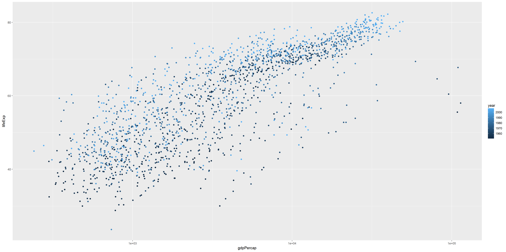

```{r setup, include=FALSE}
knitr::opts_chunk$set(echo = TRUE)
```

Goals:

  * Reorder a factor in a principled way based on the data and demonstrate the effect in arranged data and in figures.
  * Improve a figure (or make one from scratch), using new knowledge, e.g., control the color scheme, use factor levels, smoother mechanics.
  * Implement visualization design principles.
  * Write some data to file and load it back into R. E.g., save a plot to file and include it in a R Markdown report via ``.
  * Organise your github, to celebrate the completion of STAT 545 and/or to prepare for the glorious future of STAT 547.


```{r}
suppressPackageStartupMessages(library(tidyverse))
suppressPackageStartupMessages(library(gapminder))
suppressPackageStartupMessages(library(forcats))
suppressPackageStartupMessages(library(RColorBrewer))
```


### Factor management

Step goals:

* Define factor variables;
* Drop factor / levels;
* Reorder levels based on knowledge from data.
  
    
#### Gapminder version:

**Drop Oceania.** Filter the Gapminder data to remove observations associated with the `continent` of Oceania.  Additionally, remove unused factor levels. Provide concrete information on the data before and after removing these rows and Oceania; address the number of rows and the levels of the affected factors.
```{r}
#Looking into gapminder
str(gapminder)
levels(gapminder$continent)
summary(gapminder$continent)


#Looking into gapminder after removing observations associated with the continent of Oceania
gapminder_woocn <- gapminder %>% 
  filter(continent != "Oceania")
str(gapminder_woocn)
nlevels(gapminder_woocn$continent)
levels(gapminder_woocn$continent)
summary(gapminder_woocn$continent)
```
When revmoing observations associated with the continent of Oceania, the number of observations decrease from 1704 to 1680. The number of observations removed is 24, which is the observations associated with Oceania. However, all the levels of the factor `continent` are preserved.
```{r}
#Looking into gapminder_woocn after removing unused factor level `Oceania`.
gapminder_woocn_dropped <- gapminder_woocn %>% 
  droplevels()
dim(gapminder_woocn_dropped)
nlevels(gapminder_woocn_dropped$continent)
levels(gapminder_woocn_dropped$continent)
summary(gapminder_woocn_dropped$continent)

```
Unused factor level `Oceania` is removed. The number of observations is still 1680. The number of factor levels is 4 now.
  
  
**Reorder the levels of `country` or `continent`.** Use the forcats package to change the order of the factor levels, based on a principled summary of one of the quantitative variables. Consider experimenting with a summary statistic beyond the most basic choice of the median.
```{r}
##default order is alphabetical
levels(gapminder_woocn_dropped$continent)
fct_count(gapminder_woocn_dropped$continent)

##order by frequency
fct_count(gapminder_woocn_dropped$continent)
gapminder_woocn_dropped$continent %>% 
  fct_infreq() %>%
  levels() %>% head()

##order continents by median life expectancy
gapminder_woocn_dropped$continent %>% 
  fct_reorder(gapminder_woocn_dropped$lifeExp, .desc = TRUE) %>% 
  levels() %>% head()

##order continents by minimun value of life expectancy
gapminder_woocn_dropped$continent %>% 
  fct_reorder(gapminder_woocn_dropped$lifeExp, max, .desc = TRUE) %>% 
  levels() %>% head()
```
There are several ways to change the order of the factor levels. By default, factor levels are ordered alphabetically. Firstly, the factor levels are reordered by frequency. In addition, the order is changed by median value of life expectancy using `fct_reorder()`. The default summarizing function is `median()`. Lastly, maximum value of life expectancy is selected as summarizing function.
  
    
    
#### Common part:

Characterize the (derived) data before and after your factor re-leveling.

  * Explore the effects of `arrange()`. Does merely arranging the data have any effect on, say, a figure?
    
As shown below, `arrange()` changes the order of observations (by ascending order of lifeExp) but it has no impact on the boxplot. In both boxplots, 4 plots are ordered alphabetically. THis is because all factor levels are ordered alphabetically. This shows that `arrange()` has no impact on the order of factor levels.
```{r}
#Boxplot for gapminder_woocn_dropped
gapminder_woocn_dropped %>% 
  ggplot(aes(x=continent, y=lifeExp)) + 
  geom_boxplot() +
  labs(title="Boxplot")

#Boxplot for gapminder_woocn_dropped arranged by lifeExp
g1 <- gapminder_woocn_dropped %>% 
  arrange(lifeExp)

g1 %>% 
  ggplot(aes(x=continent, y=lifeExp)) + 
  geom_boxplot() +
  labs(title="Boxplot")
  

#Looking at gapminder_woocn_dropped
head(gapminder_woocn_dropped)
tail(gapminder_woocn_dropped)
levels(gapminder_woocn_dropped$continent)


#Looking at gapminder_woocn_dropped arranged by lifeExp
head(g1)
tail(g1)
levels(g1$continent)
```
  
  * Explore the effects of reordering a factor and factor reordering coupled with `arrange()`. Especially, what effect does this have on a figure?
    
The plots in boxplot are reordered as `continent` factor levels are reordered. The default summarizing function is `median()` for `fct_reorder()`. Thus, the plots in the boxplot are arranged by the median value of lifeExp in each continent. Median values are shown in the boxplot and this can be verified. However, the order of observations in data is not altered compared to `gapminder_woocn_dropped`. This means reordering a factor does not affect the order of observaions in data. 
As shown previously, adding `arrange()` only has an impact on the order of observations, not on the order of factor levels.
```{r}
#Boxplot for gapminder_woocn_dropped after reordering a factor `continent`
g1_1 <- gapminder_woocn_dropped %>% 
  mutate(continent = fct_reorder(continent, lifeExp, .desc = TRUE))
g1_1 %>% 
  ggplot(aes(x=continent, y=lifeExp)) + 
  geom_boxplot() +
  labs(title="Boxplot")

#Boxplot for gapminder_woocn_dropped after reordering a factor `continent`coupled with `arrage(lifeExp)`
g1_2 <- g1_1 %>% 
  arrange(lifeExp)
g1_2 %>% 
  ggplot(aes(x=continent, y=lifeExp)) + 
  geom_boxplot() +
  labs(title="Boxplot")

#Looking at gapminder_woocn_dropped after reordering a factor `continent`
head(g1_1)
tail(g1_1)
levels(g1_1$continent)

#Looking at gapminder_woocn_dropped after reordering a factor `continent`coupled with `arrage(lifeExp)`
head(g1_2)
tail(g1_2)
levels(g1_2$continent)


```
  
    
      
In addition, `fct_reorder2()` is used for a plot of a quantitative y against another quantitative x. After using `fct_reorder2()`, the order in the legend is changed. In `fct_reorder()`, the default summarizing function is `median()`. However, it seems not to be applied to `fct_reorder2()`. The median value of lifeExp in Canada is higher than that in Australia. However, in the legend after treatment, Australia comes earlier than Canada. The order seems to be ordered by the last value of lifeExp.
```{r}
#fct_reorder2() 
# a quantitative x against another quantitative y 
h_countries <- c("Korea, Rep.", "Japan", "China", "Canada", "Australia")

h_gap <- gapminder %>%
  filter(country %in% h_countries) %>% 
  droplevels()
h_gap
#Before using fct_reorder2()
ggplot(h_gap, aes(x = year, y = lifeExp, color = country)) +
  geom_line()
#After using fct_reorder2()
ggplot(h_gap, aes(x = year, y = lifeExp,
                  color = fct_reorder2(country, year, lifeExp))) +
  geom_line() +
  labs(color = "country")

#checking the median values
h_gap %>% 
  group_by(country) %>% 
  summarize(med_value = median(lifeExp)) %>% 
  arrange(desc(med_value))
```


These explorations should involve the data, the factor levels, and some figures.

### File I/O

Experiment with one or more of `write_csv()/read_csv()` (and/or TSV friends), `saveRDS()/readRDS()`, `dput()/dget()`. Create something new, probably by filtering or grouped-summarization of Singer or Gapminder. I highly recommend you fiddle with the factor levels, i.e. make them non-alphabetical (see previous section). Explore whether this survives the round trip of writing to file then reading back in.
  
    
First of all, after `write_csv()` and `read_csv()`, `Factor` is transformed to `chr`.  
  
`country` factor levels are reordered by the maximum of lifeExp to see the impact of the round trip of writing to file then reading back in. The order is going bact to alphabetical way after `write_csv()` and `read_csv()`. However, the order is preserved after `dput()` and `dget()`
```{r}
#Looking at the data after write_csv() and read_csv()
write_csv(gapminder_woocn_dropped, "gap_lifeExp.csv")
g2 <- read_csv("gap_lifeExp.csv")
str(gapminder_woocn_dropped)
str(g2)
levels(g2$continent)


##THE IMPACT OF the round trip of writing to file then reading back in

#Creating something new
g3 <- gapminder %>%
  group_by(country, continent) %>% 
  summarise(lifeExp_max = max(lifeExp)) %>% 
  ungroup()
head(levels(g3$country))

##Changing the order of `country` factor levels by the maximum of lifeExp.
g4 <- g3 %>% 
  mutate(country = fct_reorder(country, lifeExp_max))
g4
head(levels(g4$country))

#Impact on the order of factor levels by write_csv() and read_csv()
write_csv(g4, "gap_lifeExp.csv")
g4_read_csv <- read_csv("gap_lifeExp.csv") %>% 
  mutate(country=factor(country))
head(levels(g4_read_csv$country))

#Impact on the order of factor levels by dput() and dget()
dput(g4, "gap_lifeExp-dput.txt")
g4_dget <- dget("gap_lifeExp-dput.txt") %>% 
  mutate(country=factor(country))
head(levels(g4_dget$country))


```

### Visualization design

Remake at least one figure or create a new one, in light of something you learned in the recent class meetings about visualization design and color. Maybe juxtapose your first attempt and what you obtained after some time spent working on it. Reflect on the differences. If using Gapminder, you can use the country or continent color scheme that ships with Gapminder. Consult the guest lecture from Tamara Munzner and [everything here](graph00_index.html).
  
  
The scatter plot of y= lifeExp against x= gdpPercap is used.  
First of all, points are colored by continent. Then, `scale_color_brewer()` is used to see the effect. As the scale is qualitative (colored by categorical data), `scale_color_brewer()` is used.  
Secondly, points are colored by year. As the scale is sequential (colored from low to high), `scale_color_gradient()` and `scale_color_distiller()` are used. In `scale_colour_distiller()`, `direction=1` flips the order of colors.
```{r}
p1 <- gapminder %>%  
  ggplot(aes(x=gdpPercap,y=lifeExp)) + 
  geom_point(aes(colour=continent, alpha=0.3))+ 
  scale_x_log10()
p1
p1 + scale_color_brewer(palette="Dark2")


p2 <- gapminder %>%  
  ggplot(aes(x=gdpPercap,y=lifeExp)) + 
  geom_point(aes(colour=year))+ 
  scale_x_log10()
p2
p2 + scale_color_gradient(low = "White", high= "red")
p2 + scale_colour_distiller(palette="Greens")
p2 + scale_colour_distiller(palette="Greens", direction=1)

```

### Writing figures to file

Use `ggsave()` to explicitly save a plot to file. Then use `` to load and embed it in your report. You can play around with various options, such as:

  * Arguments of `ggsave()`, such as width, height, resolution or text scaling.
  * Various graphics devices, e.g. a vector vs. raster format.
  * Explicit provision of the plot object `p` via `ggsave(..., plot = p)`. Show a situation in which this actually matters.
  
  
`ggsave()` is used to save a plot to `.pdf` and `.png` files. `.pdf` is a vector format, which can scale naturally when expanded. `.png` is a raster format, which look bad when expanded. 
```{r}
ggsave("plots_saved/hw05_my_plot.pdf",width = 10, height = 6, plot = p1)
ggsave("plots_saved/hw05_my_plot.png",width = 10, scale = 1.5, dpi=200, plot = p2)
```
  
  


### But I want to do more!

Revalue a factor, e.g.:
  * ***Gapminder version***: Pick a handful of countries, each of which you can associate with a stereotypical food (or any other non-controversial thing ... sport? hobby? type of music, art or dance? animal? landscape feature?). Create an excerpt of the Gapminder data, filtered to just these countries. Create a new factor -- you pick the name! -- by mapping the existing country factor levels to the new levels.
    - Examples: Italy --> wine, Germany --> beer, Japan --> sake. (Austria, Germany) --> German, (Mexico, Spain) --> Spanish, (Portugal, Brazil) --> Portuguese. Let your creativity flourish.  
      
    
A new factor, `Currency` is created by mapping the existing country factor levels to the new levels.
```{r}
h_countries <- c("Korea, Rep.", "Japan", "China", "Canada", "Australia")
gap <- gapminder %>%
  filter(country %in% h_countries) %>% 
  droplevels()
gap %>% 
  mutate(Currency = factor(gap$country, 
                           levels=c("Korea, Rep.", "Japan", "China", "Canada", "Australia"),
                           labels=c("KRW", "JPY", "CNY", "CAD", "AUD"))) %>% 
  arrange(year)


```


