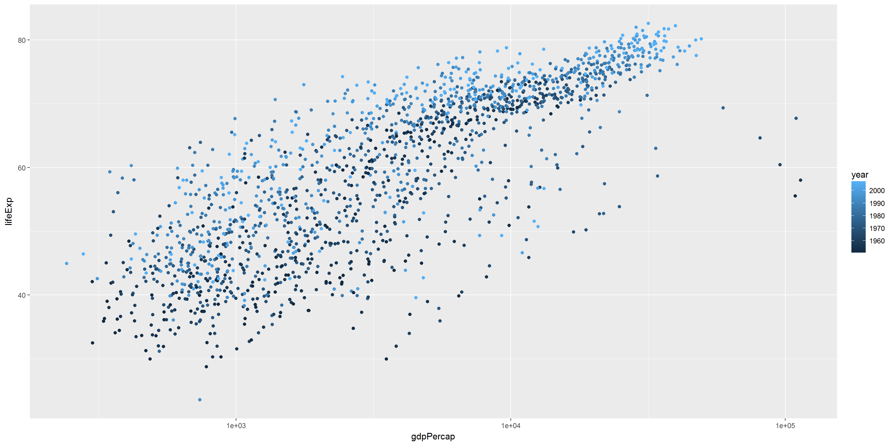

# STAT545-hw05-An-Byeongchan


Goals:

  * Reorder a factor in a principled way based on the data and demonstrate the effect in arranged data and in figures.
  * Improve a figure (or make one from scratch), using new knowledge, e.g., control the color scheme, use factor levels, smoother mechanics.
  * Implement visualization design principles.
  * Write some data to file and load it back into R. E.g., save a plot to file and include it in a R Markdown report via ``.
  * Organise your github, to celebrate the completion of STAT 545 and/or to prepare for the glorious future of STAT 547.


```r
suppressPackageStartupMessages(library(tidyverse))
```

```
## Warning: package 'tidyverse' was built under R version 3.4.2
```

```r
suppressPackageStartupMessages(library(gapminder))
suppressPackageStartupMessages(library(forcats))
suppressPackageStartupMessages(library(RColorBrewer))
```


### Factor management

Step goals:

* Define factor variables;
* Drop factor / levels;
* Reorder levels based on knowledge from data.
  
    
#### Gapminder version:

**Drop Oceania.** Filter the Gapminder data to remove observations associated with the `continent` of Oceania.  Additionally, remove unused factor levels. Provide concrete information on the data before and after removing these rows and Oceania; address the number of rows and the levels of the affected factors.

```r
#Looking into gapminder
str(gapminder)
```

```
## Classes 'tbl_df', 'tbl' and 'data.frame':	1704 obs. of  6 variables:
##  $ country  : Factor w/ 142 levels "Afghanistan",..: 1 1 1 1 1 1 1 1 1 1 ...
##  $ continent: Factor w/ 5 levels "Africa","Americas",..: 3 3 3 3 3 3 3 3 3 3 ...
##  $ year     : int  1952 1957 1962 1967 1972 1977 1982 1987 1992 1997 ...
##  $ lifeExp  : num  28.8 30.3 32 34 36.1 ...
##  $ pop      : int  8425333 9240934 10267083 11537966 13079460 14880372 12881816 13867957 16317921 22227415 ...
##  $ gdpPercap: num  779 821 853 836 740 ...
```

```r
levels(gapminder$continent)
```

```
## [1] "Africa"   "Americas" "Asia"     "Europe"   "Oceania"
```

```r
summary(gapminder$continent)
```

```
##   Africa Americas     Asia   Europe  Oceania 
##      624      300      396      360       24
```

```r
#Looking into gapminder after removing observations associated with the continent of Oceania
gapminder_woocn <- gapminder %>% 
  filter(continent != "Oceania")
str(gapminder_woocn)
```

```
## Classes 'tbl_df', 'tbl' and 'data.frame':	1680 obs. of  6 variables:
##  $ country  : Factor w/ 142 levels "Afghanistan",..: 1 1 1 1 1 1 1 1 1 1 ...
##  $ continent: Factor w/ 5 levels "Africa","Americas",..: 3 3 3 3 3 3 3 3 3 3 ...
##  $ year     : int  1952 1957 1962 1967 1972 1977 1982 1987 1992 1997 ...
##  $ lifeExp  : num  28.8 30.3 32 34 36.1 ...
##  $ pop      : int  8425333 9240934 10267083 11537966 13079460 14880372 12881816 13867957 16317921 22227415 ...
##  $ gdpPercap: num  779 821 853 836 740 ...
```

```r
nlevels(gapminder_woocn$continent)
```

```
## [1] 5
```

```r
levels(gapminder_woocn$continent)
```

```
## [1] "Africa"   "Americas" "Asia"     "Europe"   "Oceania"
```

```r
summary(gapminder_woocn$continent)
```

```
##   Africa Americas     Asia   Europe  Oceania 
##      624      300      396      360        0
```
When revmoing observations associated with the continent of Oceania, the number of observations decrease from 1704 to 1680. The number of observations removed is 24, which is the observations associated with Oceania. However, all the levels of the factor `continent` are preserved.

```r
#Looking into gapminder_woocn after removing unused factor level `Oceania`.
gapminder_woocn_dropped <- gapminder_woocn %>% 
  droplevels()
dim(gapminder_woocn_dropped)
```

```
## [1] 1680    6
```

```r
nlevels(gapminder_woocn_dropped$continent)
```

```
## [1] 4
```

```r
levels(gapminder_woocn_dropped$continent)
```

```
## [1] "Africa"   "Americas" "Asia"     "Europe"
```

```r
summary(gapminder_woocn_dropped$continent)
```

```
##   Africa Americas     Asia   Europe 
##      624      300      396      360
```
Unused factor level `Oceania` is removed. The number of observations is still 1680. The number of factor levels is 4 now.
  
  
**Reorder the levels of `country` or `continent`.** Use the forcats package to change the order of the factor levels, based on a principled summary of one of the quantitative variables. Consider experimenting with a summary statistic beyond the most basic choice of the median.

```r
##default order is alphabetical
levels(gapminder_woocn_dropped$continent)
```

```
## [1] "Africa"   "Americas" "Asia"     "Europe"
```

```r
fct_count(gapminder_woocn_dropped$continent)
```

```
## # A tibble: 4 x 2
##          f     n
##     <fctr> <int>
## 1   Africa   624
## 2 Americas   300
## 3     Asia   396
## 4   Europe   360
```

```r
##order by frequency
fct_count(gapminder_woocn_dropped$continent)
```

```
## # A tibble: 4 x 2
##          f     n
##     <fctr> <int>
## 1   Africa   624
## 2 Americas   300
## 3     Asia   396
## 4   Europe   360
```

```r
gapminder_woocn_dropped$continent %>% 
  fct_infreq() %>%
  levels() %>% head()
```

```
## [1] "Africa"   "Asia"     "Europe"   "Americas"
```

```r
##order continents by median life expectancy
gapminder_woocn_dropped$continent %>% 
  fct_reorder(gapminder_woocn_dropped$lifeExp, .desc = TRUE) %>% 
  levels() %>% head()
```

```
## [1] "Europe"   "Americas" "Asia"     "Africa"
```

```r
##order continents by minimun value of life expectancy
gapminder_woocn_dropped$continent %>% 
  fct_reorder(gapminder_woocn_dropped$lifeExp, max, .desc = TRUE) %>% 
  levels() %>% head()
```

```
## [1] "Asia"     "Europe"   "Americas" "Africa"
```
There are several ways to change the order of the factor levels. By default, factor levels are ordered alphabetically. Firstly, the factor levels are reordered by frequency. In addition, the order is changed by median value of life expectancy using `fct_reorder()`. The default summarizing function is `median()`. Lastly, maximum value of life expectancy is selected as summarizing function.
  
    
    
#### Common part:

Characterize the (derived) data before and after your factor re-leveling.

  * Explore the effects of `arrange()`. Does merely arranging the data have any effect on, say, a figure?
    
As shown below, `arrange()` changes the order of observations (by ascending order of lifeExp) but it has no impact on the boxplot. In both boxplots, 4 plots are ordered alphabetically. THis is because all factor levels are ordered alphabetically. This shows that `arrange()` has no impact on the order of factor levels.

```r
#Boxplot for gapminder_woocn_dropped
gapminder_woocn_dropped %>% 
  ggplot(aes(x=continent, y=lifeExp)) + 
  geom_boxplot() +
  labs(title="Boxplot")
```

<!-- -->

```r
#Boxplot for gapminder_woocn_dropped arranged by lifeExp
g1 <- gapminder_woocn_dropped %>% 
  arrange(lifeExp)

g1 %>% 
  ggplot(aes(x=continent, y=lifeExp)) + 
  geom_boxplot() +
  labs(title="Boxplot")
```

<!-- -->

```r
#Looking at gapminder_woocn_dropped
head(gapminder_woocn_dropped)
```

```
## # A tibble: 6 x 6
##       country continent  year lifeExp      pop gdpPercap
##        <fctr>    <fctr> <int>   <dbl>    <int>     <dbl>
## 1 Afghanistan      Asia  1952  28.801  8425333  779.4453
## 2 Afghanistan      Asia  1957  30.332  9240934  820.8530
## 3 Afghanistan      Asia  1962  31.997 10267083  853.1007
## 4 Afghanistan      Asia  1967  34.020 11537966  836.1971
## 5 Afghanistan      Asia  1972  36.088 13079460  739.9811
## 6 Afghanistan      Asia  1977  38.438 14880372  786.1134
```

```r
tail(gapminder_woocn_dropped)
```

```
## # A tibble: 6 x 6
##    country continent  year lifeExp      pop gdpPercap
##     <fctr>    <fctr> <int>   <dbl>    <int>     <dbl>
## 1 Zimbabwe    Africa  1982  60.363  7636524  788.8550
## 2 Zimbabwe    Africa  1987  62.351  9216418  706.1573
## 3 Zimbabwe    Africa  1992  60.377 10704340  693.4208
## 4 Zimbabwe    Africa  1997  46.809 11404948  792.4500
## 5 Zimbabwe    Africa  2002  39.989 11926563  672.0386
## 6 Zimbabwe    Africa  2007  43.487 12311143  469.7093
```

```r
levels(gapminder_woocn_dropped$continent)
```

```
## [1] "Africa"   "Americas" "Asia"     "Europe"
```

```r
#Looking at gapminder_woocn_dropped arranged by lifeExp
head(g1)
```

```
## # A tibble: 6 x 6
##        country continent  year lifeExp     pop gdpPercap
##         <fctr>    <fctr> <int>   <dbl>   <int>     <dbl>
## 1       Rwanda    Africa  1992  23.599 7290203  737.0686
## 2  Afghanistan      Asia  1952  28.801 8425333  779.4453
## 3       Gambia    Africa  1952  30.000  284320  485.2307
## 4       Angola    Africa  1952  30.015 4232095 3520.6103
## 5 Sierra Leone    Africa  1952  30.331 2143249  879.7877
## 6  Afghanistan      Asia  1957  30.332 9240934  820.8530
```

```r
tail(g1)
```

```
## # A tibble: 6 x 6
##            country continent  year lifeExp       pop gdpPercap
##             <fctr>    <fctr> <int>   <dbl>     <int>     <dbl>
## 1 Hong Kong, China      Asia  2002  81.495   6762476  30209.02
## 2      Switzerland    Europe  2007  81.701   7554661  37506.42
## 3          Iceland    Europe  2007  81.757    301931  36180.79
## 4            Japan      Asia  2002  82.000 127065841  28604.59
## 5 Hong Kong, China      Asia  2007  82.208   6980412  39724.98
## 6            Japan      Asia  2007  82.603 127467972  31656.07
```

```r
levels(g1$continent)
```

```
## [1] "Africa"   "Americas" "Asia"     "Europe"
```
  
  * Explore the effects of reordering a factor and factor reordering coupled with `arrange()`. Especially, what effect does this have on a figure?
    
The plots in boxplot are reordered as `continent` factor levels are reordered. The default summarizing function is `median()` for `fct_reorder()`. Thus, the plots in the boxplot are arranged by the median value of lifeExp in each continent. Median values are shown in the boxplot and this can be verified. However, the order of observations in data is not altered compared to `gapminder_woocn_dropped`. This means reordering a factor does not affect the order of observaions in data. 
As shown previously, adding `arrange()` only has an impact on the order of observations, not on the order of factor levels.

```r
#Boxplot for gapminder_woocn_dropped after reordering a factor `continent`
g1_1 <- gapminder_woocn_dropped %>% 
  mutate(continent = fct_reorder(continent, lifeExp, .desc = TRUE))
g1_1 %>% 
  ggplot(aes(x=continent, y=lifeExp)) + 
  geom_boxplot() +
  labs(title="Boxplot")
```

<!-- -->

```r
#Boxplot for gapminder_woocn_dropped after reordering a factor `continent`coupled with `arrage(lifeExp)`
g1_2 <- g1_1 %>% 
  arrange(lifeExp)
g1_2 %>% 
  ggplot(aes(x=continent, y=lifeExp)) + 
  geom_boxplot() +
  labs(title="Boxplot")
```

<!-- -->

```r
#Looking at gapminder_woocn_dropped after reordering a factor `continent`
head(g1_1)
```

```
## # A tibble: 6 x 6
##       country continent  year lifeExp      pop gdpPercap
##        <fctr>    <fctr> <int>   <dbl>    <int>     <dbl>
## 1 Afghanistan      Asia  1952  28.801  8425333  779.4453
## 2 Afghanistan      Asia  1957  30.332  9240934  820.8530
## 3 Afghanistan      Asia  1962  31.997 10267083  853.1007
## 4 Afghanistan      Asia  1967  34.020 11537966  836.1971
## 5 Afghanistan      Asia  1972  36.088 13079460  739.9811
## 6 Afghanistan      Asia  1977  38.438 14880372  786.1134
```

```r
tail(g1_1)
```

```
## # A tibble: 6 x 6
##    country continent  year lifeExp      pop gdpPercap
##     <fctr>    <fctr> <int>   <dbl>    <int>     <dbl>
## 1 Zimbabwe    Africa  1982  60.363  7636524  788.8550
## 2 Zimbabwe    Africa  1987  62.351  9216418  706.1573
## 3 Zimbabwe    Africa  1992  60.377 10704340  693.4208
## 4 Zimbabwe    Africa  1997  46.809 11404948  792.4500
## 5 Zimbabwe    Africa  2002  39.989 11926563  672.0386
## 6 Zimbabwe    Africa  2007  43.487 12311143  469.7093
```

```r
levels(g1_1$continent)
```

```
## [1] "Europe"   "Americas" "Asia"     "Africa"
```

```r
#Looking at gapminder_woocn_dropped after reordering a factor `continent`coupled with `arrage(lifeExp)`
head(g1_2)
```

```
## # A tibble: 6 x 6
##        country continent  year lifeExp     pop gdpPercap
##         <fctr>    <fctr> <int>   <dbl>   <int>     <dbl>
## 1       Rwanda    Africa  1992  23.599 7290203  737.0686
## 2  Afghanistan      Asia  1952  28.801 8425333  779.4453
## 3       Gambia    Africa  1952  30.000  284320  485.2307
## 4       Angola    Africa  1952  30.015 4232095 3520.6103
## 5 Sierra Leone    Africa  1952  30.331 2143249  879.7877
## 6  Afghanistan      Asia  1957  30.332 9240934  820.8530
```

```r
tail(g1_2)
```

```
## # A tibble: 6 x 6
##            country continent  year lifeExp       pop gdpPercap
##             <fctr>    <fctr> <int>   <dbl>     <int>     <dbl>
## 1 Hong Kong, China      Asia  2002  81.495   6762476  30209.02
## 2      Switzerland    Europe  2007  81.701   7554661  37506.42
## 3          Iceland    Europe  2007  81.757    301931  36180.79
## 4            Japan      Asia  2002  82.000 127065841  28604.59
## 5 Hong Kong, China      Asia  2007  82.208   6980412  39724.98
## 6            Japan      Asia  2007  82.603 127467972  31656.07
```

```r
levels(g1_2$continent)
```

```
## [1] "Europe"   "Americas" "Asia"     "Africa"
```
  
    
      
In addition, `fct_reorder2()` is used for a plot of a quantitative y against another quantitative x. After using `fct_reorder2()`, the order in the legend is changed. In `fct_reorder()`, the default summarizing function is `median()`. However, it seems not to be applied to `fct_reorder2()`. The median value of lifeExp in Canada is higher than that in Australia. However, in the legend after treatment, Australia comes earlier than Canada. The order seems to be ordered by the last value of lifeExp.

```r
#fct_reorder2() 
# a quantitative x against another quantitative y 
h_countries <- c("Korea, Rep.", "Japan", "China", "Canada", "Australia")

h_gap <- gapminder %>%
  filter(country %in% h_countries) %>% 
  droplevels()
h_gap
```

```
## # A tibble: 60 x 6
##      country continent  year lifeExp      pop gdpPercap
##       <fctr>    <fctr> <int>   <dbl>    <int>     <dbl>
##  1 Australia   Oceania  1952   69.12  8691212  10039.60
##  2 Australia   Oceania  1957   70.33  9712569  10949.65
##  3 Australia   Oceania  1962   70.93 10794968  12217.23
##  4 Australia   Oceania  1967   71.10 11872264  14526.12
##  5 Australia   Oceania  1972   71.93 13177000  16788.63
##  6 Australia   Oceania  1977   73.49 14074100  18334.20
##  7 Australia   Oceania  1982   74.74 15184200  19477.01
##  8 Australia   Oceania  1987   76.32 16257249  21888.89
##  9 Australia   Oceania  1992   77.56 17481977  23424.77
## 10 Australia   Oceania  1997   78.83 18565243  26997.94
## # ... with 50 more rows
```

```r
#Before using fct_reorder2()
ggplot(h_gap, aes(x = year, y = lifeExp, color = country)) +
  geom_line()
```

<!-- -->

```r
#After using fct_reorder2()
ggplot(h_gap, aes(x = year, y = lifeExp,
                  color = fct_reorder2(country, year, lifeExp))) +
  geom_line() +
  labs(color = "country")
```

<!-- -->

```r
#checking the median values
h_gap %>% 
  group_by(country) %>% 
  summarize(med_value = median(lifeExp)) %>% 
  arrange(desc(med_value))
```

```
## # A tibble: 5 x 2
##       country med_value
##        <fctr>     <dbl>
## 1       Japan  76.24500
## 2      Canada  74.98500
## 3   Australia  74.11500
## 4 Korea, Rep.  65.94450
## 5       China  64.74618
```


These explorations should involve the data, the factor levels, and some figures.

### File I/O

Experiment with one or more of `write_csv()/read_csv()` (and/or TSV friends), `saveRDS()/readRDS()`, `dput()/dget()`. Create something new, probably by filtering or grouped-summarization of Singer or Gapminder. I highly recommend you fiddle with the factor levels, i.e. make them non-alphabetical (see previous section). Explore whether this survives the round trip of writing to file then reading back in.
  
    
First of all, after `write_csv()` and `read_csv()`, `Factor` is transformed to `chr`.  
  
`country` factor levels are reordered by the maximum of lifeExp to see the impact of the round trip of writing to file then reading back in. The order is going bact to alphabetical way after `write_csv()` and `read_csv()`. However, the order is preserved after `dput()` and `dget()`

```r
#Looking at the data after write_csv() and read_csv()
write_csv(gapminder_woocn_dropped, "gap_lifeExp.csv")
g2 <- read_csv("gap_lifeExp.csv")
```

```
## Parsed with column specification:
## cols(
##   country = col_character(),
##   continent = col_character(),
##   year = col_integer(),
##   lifeExp = col_double(),
##   pop = col_integer(),
##   gdpPercap = col_double()
## )
```

```r
str(gapminder_woocn_dropped)
```

```
## Classes 'tbl_df', 'tbl' and 'data.frame':	1680 obs. of  6 variables:
##  $ country  : Factor w/ 140 levels "Afghanistan",..: 1 1 1 1 1 1 1 1 1 1 ...
##  $ continent: Factor w/ 4 levels "Africa","Americas",..: 3 3 3 3 3 3 3 3 3 3 ...
##  $ year     : int  1952 1957 1962 1967 1972 1977 1982 1987 1992 1997 ...
##  $ lifeExp  : num  28.8 30.3 32 34 36.1 ...
##  $ pop      : int  8425333 9240934 10267083 11537966 13079460 14880372 12881816 13867957 16317921 22227415 ...
##  $ gdpPercap: num  779 821 853 836 740 ...
```

```r
str(g2)
```

```
## Classes 'tbl_df', 'tbl' and 'data.frame':	1680 obs. of  6 variables:
##  $ country  : chr  "Afghanistan" "Afghanistan" "Afghanistan" "Afghanistan" ...
##  $ continent: chr  "Asia" "Asia" "Asia" "Asia" ...
##  $ year     : int  1952 1957 1962 1967 1972 1977 1982 1987 1992 1997 ...
##  $ lifeExp  : num  28.8 30.3 32 34 36.1 ...
##  $ pop      : int  8425333 9240934 10267083 11537966 13079460 14880372 12881816 13867957 16317921 22227415 ...
##  $ gdpPercap: num  779 821 853 836 740 ...
##  - attr(*, "spec")=List of 2
##   ..$ cols   :List of 6
##   .. ..$ country  : list()
##   .. .. ..- attr(*, "class")= chr  "collector_character" "collector"
##   .. ..$ continent: list()
##   .. .. ..- attr(*, "class")= chr  "collector_character" "collector"
##   .. ..$ year     : list()
##   .. .. ..- attr(*, "class")= chr  "collector_integer" "collector"
##   .. ..$ lifeExp  : list()
##   .. .. ..- attr(*, "class")= chr  "collector_double" "collector"
##   .. ..$ pop      : list()
##   .. .. ..- attr(*, "class")= chr  "collector_integer" "collector"
##   .. ..$ gdpPercap: list()
##   .. .. ..- attr(*, "class")= chr  "collector_double" "collector"
##   ..$ default: list()
##   .. ..- attr(*, "class")= chr  "collector_guess" "collector"
##   ..- attr(*, "class")= chr "col_spec"
```

```r
levels(g2$continent)
```

```
## NULL
```

```r
##THE IMPACT OF the round trip of writing to file then reading back in

#Creating something new
g3 <- gapminder %>%
  group_by(country, continent) %>% 
  summarise(lifeExp_max = max(lifeExp)) %>% 
  ungroup()
head(levels(g3$country))
```

```
## [1] "Afghanistan" "Albania"     "Algeria"     "Angola"      "Argentina"  
## [6] "Australia"
```

```r
##Changing the order of `country` factor levels by the maximum of lifeExp.
g4 <- g3 %>% 
  mutate(country = fct_reorder(country, lifeExp_max))
g4
```

```
## # A tibble: 142 x 3
##        country continent lifeExp_max
##         <fctr>    <fctr>       <dbl>
##  1 Afghanistan      Asia      43.828
##  2     Albania    Europe      76.423
##  3     Algeria    Africa      72.301
##  4      Angola    Africa      42.731
##  5   Argentina  Americas      75.320
##  6   Australia   Oceania      81.235
##  7     Austria    Europe      79.829
##  8     Bahrain      Asia      75.635
##  9  Bangladesh      Asia      64.062
## 10     Belgium    Europe      79.441
## # ... with 132 more rows
```

```r
head(levels(g4$country))
```

```
## [1] "Sierra Leone" "Angola"       "Afghanistan"  "Liberia"     
## [5] "Rwanda"       "Mozambique"
```

```r
#Impact on the order of factor levels by write_csv() and read_csv()
write_csv(g4, "gap_lifeExp.csv")
g4_read_csv <- read_csv("gap_lifeExp.csv") %>% 
  mutate(country=factor(country))
```

```
## Parsed with column specification:
## cols(
##   country = col_character(),
##   continent = col_character(),
##   lifeExp_max = col_double()
## )
```

```r
head(levels(g4_read_csv$country))
```

```
## [1] "Afghanistan" "Albania"     "Algeria"     "Angola"      "Argentina"  
## [6] "Australia"
```

```r
#Impact on the order of factor levels by dput() and dget()
dput(g4, "gap_lifeExp-dput.txt")
g4_dget <- dget("gap_lifeExp-dput.txt") %>% 
  mutate(country=factor(country))
head(levels(g4_dget$country))
```

```
## [1] "Sierra Leone" "Angola"       "Afghanistan"  "Liberia"     
## [5] "Rwanda"       "Mozambique"
```

### Visualization design

Remake at least one figure or create a new one, in light of something you learned in the recent class meetings about visualization design and color. Maybe juxtapose your first attempt and what you obtained after some time spent working on it. Reflect on the differences. If using Gapminder, you can use the country or continent color scheme that ships with Gapminder. Consult the guest lecture from Tamara Munzner and [everything here](graph00_index.html).
  
  
The scatter plot of y= lifeExp against x= gdpPercap is used.  
First of all, points are colored by continent. Then, `scale_color_brewer()` is used to see the effect. As the scale is qualitative (colored by categorical data), `scale_color_brewer()` is used.  
Secondly, points are colored by year. As the scale is sequential (colored from low to high), `scale_color_gradient()` and `scale_color_distiller()` are used. In `scale_colour_distiller()`, `direction=1` flips the order of colors.

```r
p1 <- gapminder %>%  
  ggplot(aes(x=gdpPercap,y=lifeExp)) + 
  geom_point(aes(colour=continent, alpha=0.3))+ 
  scale_x_log10()
p1
```

<!-- -->

```r
p1 + scale_color_brewer(palette="Dark2")
```

<!-- -->

```r
p2 <- gapminder %>%  
  ggplot(aes(x=gdpPercap,y=lifeExp)) + 
  geom_point(aes(colour=year))+ 
  scale_x_log10()
p2
```

<!-- -->

```r
p2 + scale_color_gradient(low = "White", high= "red")
```

<!-- -->

```r
p2 + scale_colour_distiller(palette="Greens")
```

<!-- -->

```r
p2 + scale_colour_distiller(palette="Greens", direction=1)
```

<!-- -->

### Writing figures to file

Use `ggsave()` to explicitly save a plot to file. Then use `` to load and embed it in your report. You can play around with various options, such as:

  * Arguments of `ggsave()`, such as width, height, resolution or text scaling.
  * Various graphics devices, e.g. a vector vs. raster format.
  * Explicit provision of the plot object `p` via `ggsave(..., plot = p)`. Show a situation in which this actually matters.
  
  
`ggsave()` is used to save a plot to `.pdf` and `.png` files. `.pdf` is a vector format, which can scale naturally when expanded. `.png` is a raster format, which look bad when expanded. 

```r
ggsave("plots_saved/hw05_my_plot.pdf",width = 10, height = 6, plot = p1)
ggsave("plots_saved/hw05_my_plot.png",width = 10, scale = 1.5, dpi=200, plot = p2)
```

```
## Saving 15 x 7.5 in image
```
  
  


### But I want to do more!

Revalue a factor, e.g.:
  * ***Gapminder version***: Pick a handful of countries, each of which you can associate with a stereotypical food (or any other non-controversial thing ... sport? hobby? type of music, art or dance? animal? landscape feature?). Create an excerpt of the Gapminder data, filtered to just these countries. Create a new factor -- you pick the name! -- by mapping the existing country factor levels to the new levels.
    - Examples: Italy --> wine, Germany --> beer, Japan --> sake. (Austria, Germany) --> German, (Mexico, Spain) --> Spanish, (Portugal, Brazil) --> Portuguese. Let your creativity flourish.  
      
    
A new factor, `Currency` is created by mapping the existing country factor levels to the new levels.

```r
h_countries <- c("Korea, Rep.", "Japan", "China", "Canada", "Australia")
gap <- gapminder %>%
  filter(country %in% h_countries) %>% 
  droplevels()
gap %>% 
  mutate(Currency = factor(gap$country, 
                           levels=c("Korea, Rep.", "Japan", "China", "Canada", "Australia"),
                           labels=c("KRW", "JPY", "CNY", "CAD", "AUD"))) %>% 
  arrange(year)
```

```
## # A tibble: 60 x 7
##        country continent  year  lifeExp       pop  gdpPercap Currency
##         <fctr>    <fctr> <int>    <dbl>     <int>      <dbl>   <fctr>
##  1   Australia   Oceania  1952 69.12000   8691212 10039.5956      AUD
##  2      Canada  Americas  1952 68.75000  14785584 11367.1611      CAD
##  3       China      Asia  1952 44.00000 556263527   400.4486      CNY
##  4       Japan      Asia  1952 63.03000  86459025  3216.9563      JPY
##  5 Korea, Rep.      Asia  1952 47.45300  20947571  1030.5922      KRW
##  6   Australia   Oceania  1957 70.33000   9712569 10949.6496      AUD
##  7      Canada  Americas  1957 69.96000  17010154 12489.9501      CAD
##  8       China      Asia  1957 50.54896 637408000   575.9870      CNY
##  9       Japan      Asia  1957 65.50000  91563009  4317.6944      JPY
## 10 Korea, Rep.      Asia  1957 52.68100  22611552  1487.5935      KRW
## # ... with 50 more rows
```


