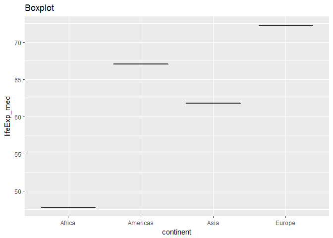

# STAT545-hw05-An-Byeongchan


Goals:

  * Reorder a factor in a principled way based on the data and demonstrate the effect in arranged data and in figures.
  * Improve a figure (or make one from scratch), using new knowledge, e.g., control the color scheme, use factor levels, smoother mechanics.
  * Implement visualization design principles.
  * Write some data to file and load it back into R. E.g., save a plot to file and include it in a R Markdown report via ``.
  * Organise your github, to celebrate the completion of STAT 545 and/or to prepare for the glorious future of STAT 547.


```r
suppressPackageStartupMessages(library(tidyverse))
```

```
## Warning: package 'tidyverse' was built under R version 3.4.2
```

```r
suppressPackageStartupMessages(library(gapminder))
suppressPackageStartupMessages(library(forcats))
```


### Factor management

Step goals:

* Define factor variables;
* Drop factor / levels;
* Reorder levels based on knowledge from data.

#### Gapminder version:

**Drop Oceania.** Filter the Gapminder data to remove observations associated with the `continent` of Oceania.  Additionally, remove unused factor levels. Provide concrete information on the data before and after removing these rows and Oceania; address the number of rows and the levels of the affected factors.

```r
str(gapminder)
```

```
## Classes 'tbl_df', 'tbl' and 'data.frame':	1704 obs. of  6 variables:
##  $ country  : Factor w/ 142 levels "Afghanistan",..: 1 1 1 1 1 1 1 1 1 1 ...
##  $ continent: Factor w/ 5 levels "Africa","Americas",..: 3 3 3 3 3 3 3 3 3 3 ...
##  $ year     : int  1952 1957 1962 1967 1972 1977 1982 1987 1992 1997 ...
##  $ lifeExp  : num  28.8 30.3 32 34 36.1 ...
##  $ pop      : int  8425333 9240934 10267083 11537966 13079460 14880372 12881816 13867957 16317921 22227415 ...
##  $ gdpPercap: num  779 821 853 836 740 ...
```

```r
levels(gapminder$continent)
```

```
## [1] "Africa"   "Americas" "Asia"     "Europe"   "Oceania"
```

```r
gapminder_woocn <- gapminder %>% 
  filter(continent != "Oceania")
str(gapminder_woocn)
```

```
## Classes 'tbl_df', 'tbl' and 'data.frame':	1680 obs. of  6 variables:
##  $ country  : Factor w/ 142 levels "Afghanistan",..: 1 1 1 1 1 1 1 1 1 1 ...
##  $ continent: Factor w/ 5 levels "Africa","Americas",..: 3 3 3 3 3 3 3 3 3 3 ...
##  $ year     : int  1952 1957 1962 1967 1972 1977 1982 1987 1992 1997 ...
##  $ lifeExp  : num  28.8 30.3 32 34 36.1 ...
##  $ pop      : int  8425333 9240934 10267083 11537966 13079460 14880372 12881816 13867957 16317921 22227415 ...
##  $ gdpPercap: num  779 821 853 836 740 ...
```

```r
nlevels(gapminder_woocn$continent)
```

```
## [1] 5
```

```r
levels(gapminder_woocn$continent)
```

```
## [1] "Africa"   "Americas" "Asia"     "Europe"   "Oceania"
```

```r
gapminder_woocn_dropped <- gapminder_woocn %>% 
  droplevels()
nlevels(gapminder_woocn_dropped$continent)
```

```
## [1] 4
```

```r
levels(gapminder_woocn_dropped$continent)
```

```
## [1] "Africa"   "Americas" "Asia"     "Europe"
```


**Reorder the levels of `country` or `continent`.** Use the forcats package to change the order of the factor levels, based on a principled summary of one of the quantitative variables. Consider experimenting with a summary statistic beyond the most basic choice of the median.

```r
##order continents by median life expectancy
gapminder_woocn_dropped$continent %>% 
  fct_reorder(gapminder_woocn_dropped$lifeExp, .desc = TRUE) %>% 
  levels() %>% head()
```

```
## [1] "Europe"   "Americas" "Asia"     "Africa"
```

#### Common part:

While you're here, practice writing to file and reading back in (see next section).

Characterize the (derived) data before and after your factor re-leveling.

  * Explore the effects of `arrange()`. Does merely arranging the data have any effect on, say, a figure?

```r
gapminder_woocn_dropped %>% 
  ggplot(aes(x=continent, y=lifeExp)) + 
  geom_boxplot() +
  labs(title="Boxplot")
```

<!-- -->

```r
g1 <- gapminder_woocn_dropped %>% 
  group_by(continent) %>% 
  summarize(lifeExp_med = median(lifeExp)) %>% 
  arrange(desc(lifeExp_med))

g1 %>%   
  ggplot(aes(x=continent, y=lifeExp_med)) + 
  geom_boxplot() +
  labs(title="Boxplot")
```

<!-- -->
  
  * Explore the effects of reordering a factor and factor reordering coupled with `arrange()`. Especially, what effect does this have on a figure?

```r
g2 <- gapminder_woocn_dropped %>% 
  group_by(continent) %>% 
  summarize(lifeExp_med = median(lifeExp)) %>% 
  arrange(desc(lifeExp_med))


g2 <- fct_reorder(gapminder_woocn_dropped$continent, gapminder_woocn_dropped$lifeExp, .desc = TRUE) %>% 
  levels() %>% head()
g2
```

```
## [1] "Europe"   "Americas" "Asia"     "Africa"
```
  
  

These explorations should involve the data, the factor levels, and some figures.

### File I/O

Experiment with one or more of `write_csv()/read_csv()` (and/or TSV friends), `saveRDS()/readRDS()`, `dput()/dget()`. Create something new, probably by filtering or grouped-summarization of Singer or Gapminder. I highly recommend you fiddle with the factor levels, i.e. make them non-alphabetical (see previous section). Explore whether this survives the round trip of writing to file then reading back in.

### Visualization design

Remake at least one figure or create a new one, in light of something you learned in the recent class meetings about visualization design and color. Maybe juxtapose your first attempt and what you obtained after some time spent working on it. Reflect on the differences. If using Gapminder, you can use the country or continent color scheme that ships with Gapminder. Consult the guest lecture from Tamara Munzner and [everything here](graph00_index.html).

### Writing figures to file

Use `ggsave()` to explicitly save a plot to file. Then use `` to load and embed it in your report. You can play around with various options, such as:

  * Arguments of `ggsave()`, such as width, height, resolution or text scaling.
  * Various graphics devices, e.g. a vector vs. raster format.
  * Explicit provision of the plot object `p` via `ggsave(..., plot = p)`. Show a situation in which this actually matters.

### Clean up your repo!

You have 6 weeks of R Markdown and GitHub experience now. You've reviewed 4 peer assignments. Surely there are aspects of your current repo organization that could be better. Deal with that. Ideas:

  * A nice Table of Contents in top-level README that links to individual pieces of work.
    - Good for future: `hw03 dplyr verbs`
    - Bummer in the future: `hw03`
    - Include a slug with content info!
  * Remove all downstream stuff, e.g. figures, html, etc. and re-render everything. It will be nice to not have weird, vestigial files lying around to puzzle you in future.
  * Anything that's `Rmd` but that could be `md`? Convert it.

### But I want to do more!

Make a deeper exploration of the forcats packages, i.e. try more of the factor level reordering functions.

Revalue a factor, e.g.:

  * ***Singer version***: Pick a handful of locations (they are named `city`, try using `distinct()`) that you can pinpoint to a geographical place (city, region, country, continent,...). Create an excerpt of the Singer data, filtered to just those rows. Create a (couple of) new factor(s) -- you pick the name(s)! -- by mapping the existing `city` factor levels to the new (city, region, country...) levels.
    - Examples: "London, England" --> "London", "England", "UK", "Europe";  
    - "Los Angeles, CA" --> "Los Angeles", "California", "USA", "Americas";
    - ...
    - "310, Louisiana" --> "New Orleans", "Louisiana", "USA", "Americas".  
    
  When you get tired, if you still have time on your hand, try to make this process of geolocalization more streamlined: you may want to try and use the `separate` function from tidyr.
  
  * ***Gapminder version***: Pick a handful of countries, each of which you can associate with a stereotypical food (or any other non-controversial thing ... sport? hobby? type of music, art or dance? animal? landscape feature?). Create an excerpt of the Gapminder data, filtered to just these countries. Create a new factor -- you pick the name! -- by mapping the existing country factor levels to the new levels.
    - Examples: Italy --> wine, Germany --> beer, Japan --> sake. (Austria, Germany) --> German, (Mexico, Spain) --> Spanish, (Portugal, Brazil) --> Portuguese. Let your creativity flourish.

### Report your process

You're encouraged to reflect on what was hard/easy, problems you solved, helpful tutorials you read, etc. Give credit to your sources, whether it's a blog post, a fellow student, an online tutorial, etc.

### Submit the assignment

It's always the same: add the teaching stuff as collabs, open the issue, you are done.

